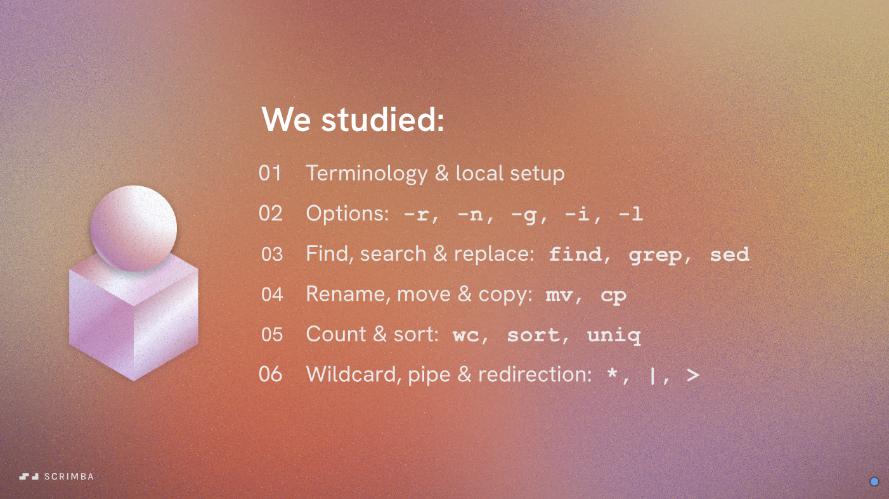

# What we learned in this section

1. Terminology & local setup.
2. Options: -r, -n, -g, -i, -l
3. Find, search, & replace: find, grep, sed.
4. Rename, move, copy, & delete: mv, cp, rm.
5. Count & sort: wc, sort, uniq.
6. Wildcard pipe & redirection: *, |, >, >>

