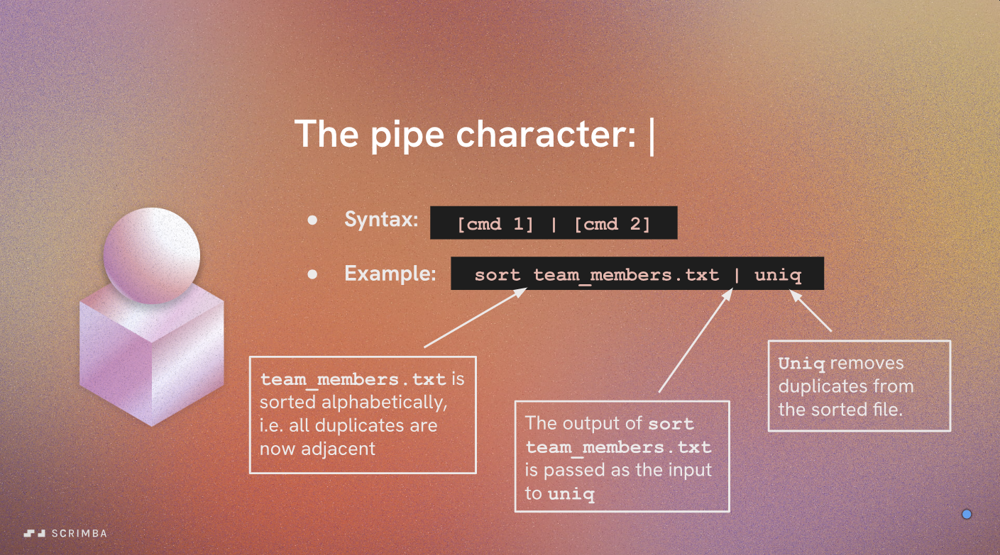
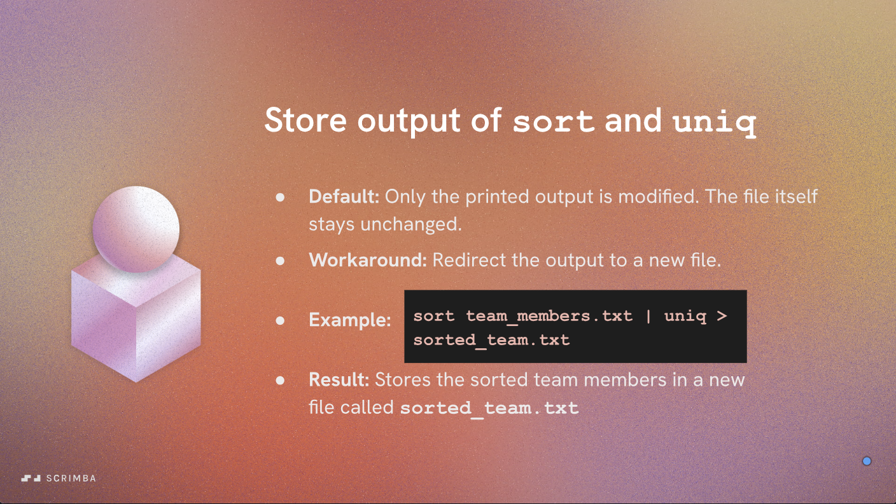

# Sorting File Contents - Part 2

In this section, we will learn about the pipeline operator (`|`) and how it can be used to chain commands together to process file contents more efficiently.

## The Pipeline Operator (`|`)

The pipeline operator (`|`) takes the output of command 1 and uses it as the input for command 2 and so on. This allows us to combine multiple commands in a single line, making our workflows more streamlined and efficient.

It goes like this:

```bash
command1 | command2 | command3
```



### Example Usage

For example, if you want to sort the contents of a file and then display only the unique lines, you can use the following command:

```bash
cat filename.txt | sort | uniq
```

In this command:

- `cat filename.txt` reads the contents of the file.
- `sort` sorts the lines of the file.
- `uniq` removes duplicate lines from the sorted output.

### Benefits of Using Pipelines

- **Efficiency**: Pipelines allow you to process data in stages, reducing the need for intermediate files.
- **Clarity**: Chaining commands together can make your intentions clearer and your commands easier to read.
- **Flexibility**: You can easily modify one part of the pipeline without affecting the others.

### Applying to Our Example

Let's apply this to our previous example of sorting file contents to apply our command to the `team.txt` file.

```bash
cat team.txt | sort | uniq > sorted_team.txt
```

This command will read the contents of `team.txt`, sort the lines, remove any duplicates, and then save the output to a new file called `sorted_team.txt`.
You can verify the contents of the new file by using:

```bash
cat sorted_team.txt
```

To replace the original file with the sorted contents, you can use:

```bash
mv sorted_team.txt team.txt
```

This will rename `sorted_team.txt` to `team.txt`, effectively replacing the original file with the sorted and unique contents.


