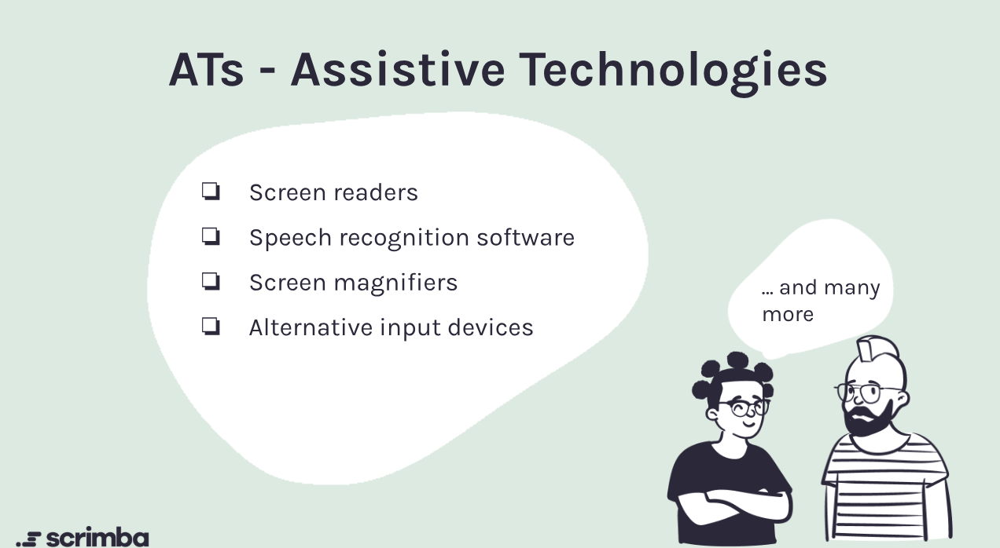
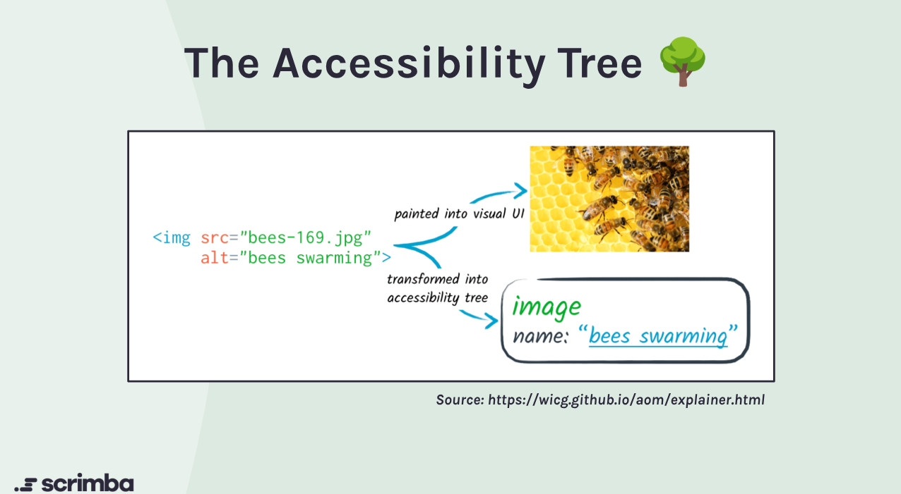

# Accessible Development

This course is committed to following best practices for web accessibility to ensure that all users, including those with disabilities, can access and navigate the content effectively.

## What is Accessibility in Web Development?

Accessibility in web development refers to the practice of designing and building websites and applications that can be used by people with a wide range of abilities and disabilities. This includes individuals with visual, auditory, motor, and cognitive impairments. The goal is to create an inclusive digital environment where everyone can access information and interact with web content without barriers.

Key accessibility features:

- **Semantic HTML**: The course uses semantic HTML elements (like `<header>`, `<nav>`, `<main>`, `<section>`, `<article>`, and `<footer>`) to provide meaningful structure to the content, which helps screen readers interpret the page correctly.
- **Keyboard Navigation**: All interactive elements (like links, buttons, and forms) are fully operable using keyboard navigation. This includes using the `Tab` key to navigate through links and buttons, and `Enter` or `Space` to activate them.
- **ARIA Landmarks and Roles**: The course incorporates ARIA (Accessible Rich Internet Applications) landmarks and roles to enhance the accessibility of dynamic content and complex UI components. This helps assistive technologies understand the purpose of different sections of the page.
- **Alt Text for Images**: All images used in the course include descriptive `alt` attributes to provide context for users who rely on screen readers.
- **Color Contrast**: The color scheme of the course ensures sufficient contrast between text and background colors, making it easier for users with visual impairments to read the content.
- **Responsive Design**: The course is designed to be responsive, ensuring that it is accessible on various devices and screen sizes, including mobile phones and tablets.
- **Focus Indicators**: Clear focus indicators are provided for interactive elements to help users identify which element is currently focused when navigating via keyboard.
- **Skip Navigation Links**: A "Skip to main content" link is provided at the top of the page to allow users to bypass repetitive navigation links and go directly to the main content.
- **Accessible Forms**: Any forms included in the course are designed with accessibility in mind, including proper labeling, error messages, and instructions.
- **Testing with Assistive Technologies**: The course has been tested with various assistive technologies, such as screen readers (e.g., NVDA, JAWS, VoiceOver) and keyboard-only navigation, to ensure compatibility and usability.
By implementing these accessibility features, the course aims to provide an inclusive learning experience for all users, regardless of their abilities or disabilities.

### Conclusion

Accessibility is a fundamental aspect of web development that benefits everyone. By prioritizing accessibility, we create a more inclusive web that allows all users to engage with content effectively. This course serves as a model for implementing accessibility best practices, ensuring that all learners can participate fully in the digital landscape.

**Instructor**: Fredrik Ridderfalk

This course is part of the [Scrimba Fullstack Developer Career Path](https://scrimba.com/learn/fullstack).
