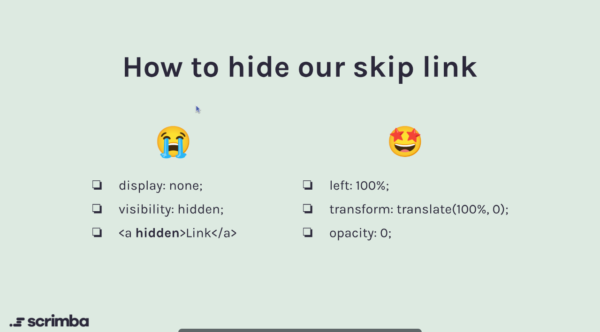

# Skip Navigation Link

## Introduction

A skip navigation link is a crucial accessibility feature that allows users, especially those using screen readers or keyboard navigation, to bypass repetitive content and navigate directly to the main content of a webpage. This is particularly important for users with disabilities who may find it challenging to navigate through extensive menus or links.

## Implementation

To implement a skip navigation link, follow these steps:

1. **Create the Link**: Add a link at the top of your HTML document that points to the main content area. Use a clear and descriptive label, such as "Skip to main content."

```html
    <a href="#main-content" class="skip-link">Skip to main content</a>
```

2. **Identify the Main Content Area**: Ensure that the main content area has a corresponding ID that the skip link can target.

```html
<main id="main-content">
  <!-- Main content goes here -->
</main>
```

3. **Style the Link**: Use CSS to visually hide the skip link until it receives focus. This ensures that it is only visible to keyboard users.

```css
.skip-link {
  position: absolute;
  top: -40px;
  left: 0;
  background: #fff;
  color: #000;
  padding: 8px 16px;
  border: 1px solid #000;
  z-index: 100;
  transition: top 0.3s;
}

.skip-link:focus {
  top: 0;
}
```

4. **Hide the Link Initially**: The link should be hidden off-screen by default and only become visible when focused by using the following CSS:

```css
left: 100%;
/* or */
transform: translate(100%, 0);
/* or */
opacity: 0;
```

Note: Screenreader can't read elements with `display: none` or `visibility: hidden`, so avoid using these properties.



## Best Practices

- **Positioning**: Place the skip link at the top of the page, before any other content, to ensure it is the first focusable element.
- **Visibility**: Ensure the skip link is visually hidden but still accessible to screen readers. Use techniques like `clip` or `absolute positioning` to achieve this.
- **Testing**: Test the skip link with various assistive technologies to ensure it behaves as expected.

## Conclusion

Skip navigation links are a simple yet effective way to enhance the accessibility of your web applications. By implementing them thoughtfully, you can significantly improve the user experience for individuals with disabilities.
