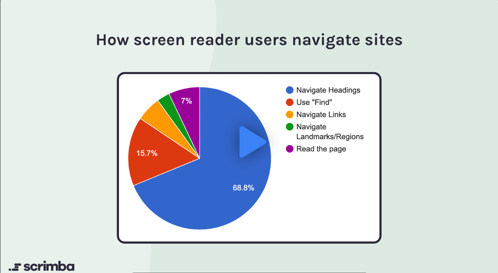
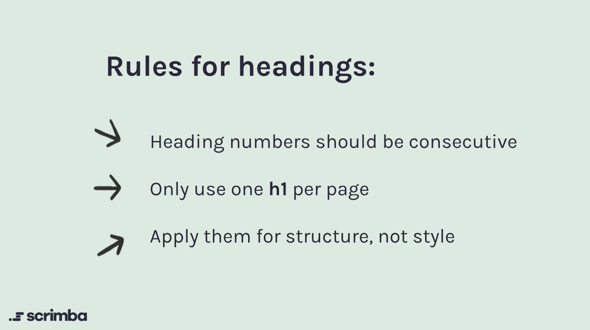

# Text Size

In this project, you will adjust the text size of various elements to ensure they are easily readable for all users. You will modify the CSS file to set appropriate font sizes for headings, paragraphs, and other text elements.



## Instructions

1. Open the `index.css` file in the `skynet-project` folder.
2. Locate the CSS rules for headings (e.g., `h1`, `h2`, `h3`, etc.) and paragraphs (`p`).
3. Adjust the `font-size` property for each element to ensure proper readability. Consider using relative units (e.g., `em`, `rem`) for better scalability.
4. Save your changes and refresh the browser to see the updated text sizes.
5. Ensure that the text size is consistent across different sections of the webpage and that it adheres to accessibility standards.

## Example

```css
h1 {
    font-size: 2.5rem; /* Adjusted for better readability */
}
h2 {
    font-size: 2rem; /* Adjusted for better readability */
}
h3 {
    font-size: 1.75rem; /* Adjusted for better readability */
}
p {
    font-size: 1rem; /* Adjusted for better readability */
}
```



## Why rems?

Using `rem` units for font sizes is beneficial because they are relative to the root element's font size (usually the `<html>` element). This means that if a user has set a preferred base font size in their browser settings, using `rem` will respect that preference, enhancing accessibility. It also allows for easier scaling of the entire website's typography by simply changing the root font size.

## Testing

1. Open the `index.html` file in your browser.
2. Inspect the text elements (headings, paragraphs) to verify their font sizes.
3. Test the responsiveness by resizing the browser window or using different devices.
4. Ensure that the text remains readable and accessible at various screen sizes.
5. Optionally, use browser extensions or tools to simulate different visual impairments and ensure the text size is adequate for all users.

## Conclusion

In this project, you have learned how to adjust text sizes using CSS to improve readability and accessibility. By using relative units like `rem`, you can create a more flexible and user-friendly design that accommodates various user preferences and needs. Remember to test your changes thoroughly to ensure a positive experience for all users.
