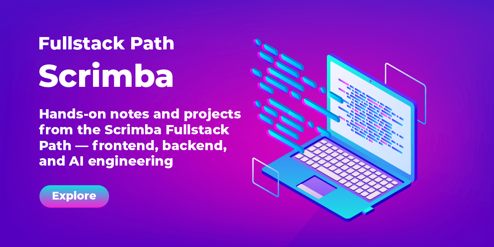

# Scrimba Fullstack Path Documentation

[](https://github.com/sobhy0101/fullstack-path-scrimba)

A curated learning diary of the Scrimba Fullstack Path — hands-on notes and projects across frontend, backend, and AI engineering.

## Built for the Real World

The Scrimba Fullstack Path is designed to equip you with the practical skills and knowledge needed to become a job-ready fullstack developer.
The curriculum is based on extensive industry research into what new hires actually need to succeed in today’s job market. You’ll gain a well-rounded, modern skill set that spans both frontend and backend development—from building beautiful interfaces to creating fast, scalable APIs.

## What I'll Learn

I’ll begin by mastering the fundamentals of frontend development with HTML, CSS, JavaScript, and React. From there, I’ll progress into fullstack territory by learning how to build backend servers and APIs with Node.js and Express.js, manage data and authentication with SQL and Supabase, and build production-ready fullstack apps using Next.js.

I’ll also use TypeScript to write safer, more scalable code, and learn how to test my applications to ensure reliability. To future-proof my skills, I’ll get a crash course on AI engineering, teaching me how to build AI-powered and agentic apps.

## Projects & Practice

Throughout the path, I’ll build over a dozen portfolio projects and solve 100s of interactive coding challenges that reinforce my learning—while helping me stand out to employers.

## Learn at Your Own Pace

The path is fully self-paced, so I can choose whether I'd like to do it part-time or full-time.

## Overview

This repository contains notes, code samples, screenshots, scripts and projects from the Scrimba Fullstack Path course. The path covers front-end and back-end development using modern technologies like JavaScript, React, Node.js, Express, SQL, and Next.js.

## What's included

- Course notes and summaries for each lesson
- Code snippets and hands-on challenge solutions
- Personal reflections and documentation to reinforce learning
- **HTML Learning Projects**: Complete projects from the standalone "Learn HTML" course (in `html-and-css-fundamentals/` folder)

## Project Structure

The repository is organized to match the official Scrimba Fullstack Path course structure:

### ✅ Completed Sections

- `01-introduction/` - Course overview and foundation concepts
- `02-html-css-fundamentals/` - HTML & CSS projects and exercises
  - Personal website project with interactive styling
  - Birthday card project demonstrating HTML structure
  - Solo project: "Visit Cairo" - A tourism website showcasing advanced HTML/CSS techniques
- `03-javascript-fundamentals/` - JavaScript learning projects and practice exercises
  - Interactive applications and coding challenges
  - Comprehensive practice area with multiple projects
  - Core JavaScript concepts and DOM manipulation
- `04-tools-of-the-trade/` - Development tools and Git/GitHub essentials
  - Essential Git and GitHub skills
  - Command line fundamentals and advanced techniques
  - Professional development workflows

### 🔒 Upcoming Sections

- `05-accessible-development/` - Web accessibility and inclusive design
- `06-essential-css/` - Advanced CSS techniques and animations
- `07-essential-javascript/` - Advanced JavaScript concepts
- `08-responsive-design/` - Mobile-first and responsive layouts
- `09-apis-async-javascript/` - Working with APIs and async programming
- `10-ai-engineering/` - Building AI-powered applications
- `11-nodejs/` - Server-side JavaScript development
- `12-databases/` - Database design and data persistence
- `13-expressjs/` - RESTful APIs and server development
- `15-reactjs-fundamentals/` - Component-based frontend development
- `19-nextjs/` - Full-stack React framework
- And more...

## Topics

- **HTML Fundamentals**: Semantic HTML, forms, accessibility, project structure (see `learn-html/`)
- **Frontend**: CSS, JavaScript, TypeScript, React, UI/UX design, responsive design
- **Backend**: Node.js, Express, SQL databases, API development
- **Full-stack**: Project integrations, deployment, testing
- **AI Engineering**: Building AI-powered apps with OpenAI APIs, embeddings, vector databases, AI agents, LangChain.js
- **Modern tools**: Next.js, Tailwind CSS, Firebase, Git/GitHub, Vercel, Vite

## Development Setup

To run the HTML learning projects locally:

```bash
# Install dependencies
npm install

# Start development server for HTML projects
npm run dev

# Build for production
npm run build
```

The development server serves the entire project from the root, allowing you to navigate between all course sections and view projects with live reloading.

## Why this repo?

Track progress, reinforce concepts, and build a portfolio of practical projects—both full-stack and AI-powered—ready for sharing and job applications.

*Course: [Scrimba Fullstack Path](https://scrimba.com/fullstack-path-c0fullstack)*

**Instructors:**

- [Per Borgen](https://scrimba.com/@perborgen)
- [Tom Chant](https://scrimba.com/@DoubleNemesis)
- [Kevin Powell](https://scrimba.com/@kevin-powell)
- [Treasure Porth](https://scrimba.com/@trezp)
- [Rachel Johnson](https://scrimba.com/@racheljohnson)
- [Bob Ziroll](https://scrimba.com/@bobziroll)

**Repo by: [Mahmoud Sobhy "Mike"](https://github.com/sobhy0101)**

### I am going to be an awesome Developer, you guys
