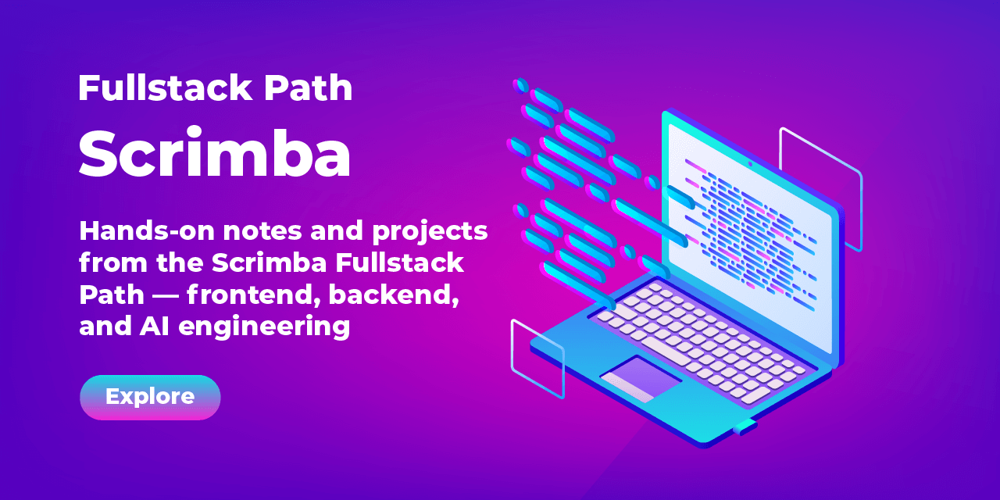

# Scrimba Fullstack Path Documentation

[](https://fullstack-path-scrimba.vercel.app/)

A curated learning diary of the Scrimba Fullstack Path — hands-on notes and projects across frontend, backend, and AI engineering.

**Live:** [fullstack-path-scrimba.vercel.app](https://fullstack-path-scrimba.vercel.app/)

## Built for the Real World

The Scrimba Fullstack Path is designed to equip you with the practical skills and knowledge needed to become a job-ready fullstack developer.
The curriculum is based on extensive industry research into what new hires actually need to succeed in today’s job market. You’ll gain a well-rounded, modern skill set that spans both frontend and backend development—from building beautiful interfaces to creating fast, scalable APIs.

## What I’ve Learned (and What’s Next)

The frontend foundation is complete — HTML, CSS, JavaScript, accessibility, responsive design, and working with APIs are all done. I’m now working through Node.js to build backend servers and APIs, and will continue into Express.js, SQL, Supabase, and production-ready fullstack apps with Next.js.

TypeScript, testing, and AI engineering are also on the path — with the AI Engineering module already explored up to RAG and vector databases before pausing to continue through the backend track first.

## Projects & Practice

Over a dozen portfolio projects have been built so far — from a tourism website and Instagram clone to an X (Twitter) clone, a food ordering app, a color generator, and an AI-powered language translation app. Hundreds of interactive coding challenges have been solved throughout, reinforcing each concept as it was introduced.

## Learn at Your Own Pace

The path is fully self-paced, so I can choose whether I'd like to do it part-time or full-time.

## Overview

This repository contains notes, code samples, screenshots, scripts and projects from the Scrimba Fullstack Path course. The path covers front-end and back-end development using modern technologies like JavaScript, React, Node.js, Express, SQL, and Next.js.

## What's included

- Course notes and summaries for each lesson
- Code snippets and hands-on challenge solutions
- Personal reflections and documentation to reinforce learning
- **HTML & CSS Projects**: Personal website, birthday card, and the "Visit Cairo" solo project (in `02-html-css-fundamentals/`)

## Project Structure

The repository is organized to match the official Scrimba Fullstack Path course structure:

### ✅ Completed Sections

- `01-introduction/` - Course overview and foundation concepts
- `02-html-css-fundamentals/` - HTML & CSS projects and exercises
  - Personal website project with interactive styling
  - Birthday card project demonstrating HTML structure
  - Solo project: "Visit Cairo" - A tourism website showcasing advanced HTML/CSS techniques
- `03-javascript-fundamentals/` - JavaScript learning projects and practice exercises
  - Interactive applications and coding challenges
  - Comprehensive practice area with multiple projects
  - Core JavaScript concepts and DOM manipulation
- `04-tools-of-the-trade/` - Development tools and Git/GitHub essentials
  - Essential Git and GitHub skills
  - Command line fundamentals and advanced techniques
  - Professional development workflows
- `05-accessible-development/` - Web accessibility and inclusive design
  - Skynet Project: accessible website rebuild
  - Skip navigation link practice
  - Final challenge and code poetry project
  - Study notes: ARIA, semantic HTML, screen readers, contrast, labels
- `06-essenntial-css/` - Advanced CSS techniques and animations
  - NFT Website (CSS grid & custom properties)
  - Build-a-Portfolio (flexbox layouts)
  - Coworking Space Site (responsive CSS)
  - Solo project: Instagram Clone
- `07-essential-javaScript/` - Advanced JavaScript concepts and ES6+ patterns
  - Cookie Consent banner
  - Meme App
  - X (Twitter) Clone
  - 20× Mini Projects collection
  - Solo project: Food Ordering App
- `08-responsive-design/` - Mobile-first and responsive layouts
  - Responsive Layout exercises
  - Products Project
  - CSS Grid project
  - Solo project: Learning Journal
- `09-apis-and-async-js/` - Fetch API, promises, async/await, and REST
  - Bored Bot (async fetch)
  - Blog Space + Solo project: Color Generator
  - War card game (callbacks & Promises)
  - Dashboard project

### 🚧 In Progress

- `10-ai-engineering/` - AI-powered applications *(paused at ~52%)*
  - AI Engineering Fundamentals
  - Dodgy Dave Stock Predictions + ArtMatch (DALL·E 3 aside)
  - RAG and Vector Databases
  - Solo project: PollyGlot (language translation app)
- `11-node.js/` - Server-side JavaScript *(started May 2026)*
  - Welcome to Node.js

### 🔒 Upcoming Sections

- `12-databases/` - Database design and data persistence
- `13-expressjs/` - RESTful APIs and server development
- `15-reactjs-fundamentals/` - Component-based frontend development
- `19-nextjs/` - Full-stack React framework
- And more...

## Topics

- **HTML Fundamentals**: Semantic HTML, forms, accessibility, project structure (see `learn-html/`)
- **Frontend**: CSS, JavaScript, TypeScript, React, UI/UX design, responsive design
- **Backend**: Node.js, Express, SQL databases, API development
- **Full-stack**: Project integrations, deployment, testing
- **AI Engineering**: Building AI-powered apps with OpenAI APIs, embeddings, vector databases, AI agents, LangChain.js
- **Modern tools**: Next.js, Tailwind CSS, Firebase, Git/GitHub, Vercel, Vite

## Deployable Projects

These subprojects can be deployed independently on Vercel:

| Project | Path | Live URL | Stack |
| --- | --- | --- | --- |
| **Learning Hub** | `/` | [fullstack-path-scrimba.vercel.app](https://fullstack-path-scrimba.vercel.app/) | Vite 8 static build — no secrets needed |
| **Color Generator** | `courses/09-apis-and-async-js/02-blog-space/solo-project-color-generator/` | — | Vite 7 + Firebase — needs `VITE_FIREBASE_*` env vars |
| **PollyGlot** | `courses/10-ai-engineering/solo-project-pollyglot/` | — | Vanilla JS + Vercel serverless function — needs `OPENAI_API_KEY` |

## Development Setup

To run the learning hub locally (Vite 8):

```bash
# Install dependencies
npm install

# Start development server
npm run dev

# Build for production
npm run build
```

The development server serves the entire project from the root, allowing you to navigate between all course sections and view projects with live reloading.

To run the **Color Generator** subproject:

```bash
cd courses/09-apis-and-async-js/02-blog-space/solo-project-color-generator
npm install
npm run dev
```

## Troubleshooting

### "vite is not recognized" Error

If you see `vite: The term 'vite' is not recognized...`, don't worry! Vite is installed **locally in your project**, not globally on your system.

**Solution**: Use one of these commands instead:

```bash
# Recommended: Use npm scripts
npm run dev

# Alternative: Use npx to run local packages
npx vite -v
```

### Understanding Node vs Vite

- **Node.js** = JavaScript runtime installed globally on your PC
- **Vite** = Development server installed in your project's `node_modules` folder
- **npm** = Package manager that comes with Node

**Updating**:

- Update Node: `winget upgrade Node.js` (Windows) or download from [nodejs.org](https://nodejs.org)
- Update Vite: `npm update vite` (updates only this project)
- Check versions: `node -v` and `npx vite -v`

### First Time Setup

If you clone this repo or haven't installed dependencies yet:

```bash
npm install
```

This creates the `node_modules` folder with Vite and other project dependencies.

## Why this repo?

Track progress, reinforce concepts, and build a portfolio of practical projects—both full-stack and AI-powered—ready for sharing and job applications.

*Course: [Scrimba Fullstack Path](https://scrimba.com/fullstack-path-c0fullstack)*

**Instructors:**

- [Per Borgen](https://scrimba.com/@perborgen)
- [Tom Chant](https://scrimba.com/@DoubleNemesis)
- [Kevin Powell](https://scrimba.com/@kevin-powell)
- [Treasure Porth](https://scrimba.com/@trezp)
- [Rachel Johnson](https://scrimba.com/@racheljohnson)
- [Bob Ziroll](https://scrimba.com/@bobziroll)

**Repo by: [Mahmoud Sobhy "Mike"](https://github.com/sobhy0101)**

### Just warming up for my developer origin story
