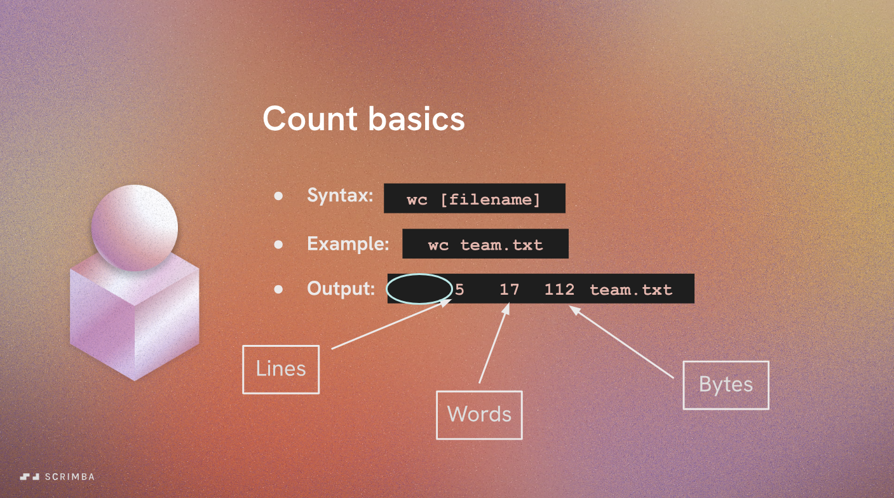
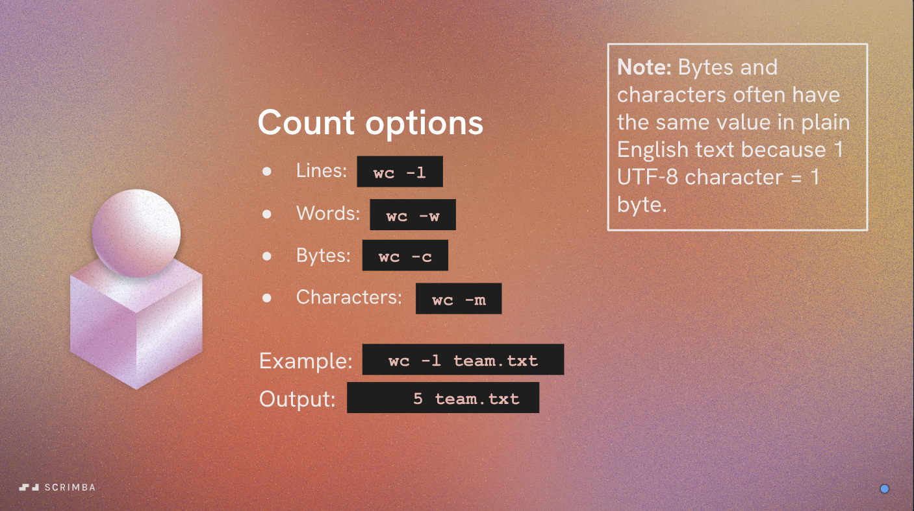

# Count Values in Files

In this section, we will learn how to count values in files using command-line tools. Counting values is a common task when analyzing data stored in text files.

## Using `wc` to Count Lines, Words, and Characters

The `wc` (word count) command is a simple and effective tool for counting lines, words, and characters in a file. Here are some common usages:

- To count the number of lines in a file:

  ```bash
  wc -l filename.txt
  ```

- To count the number of words in a file:

  ```bash
  wc -w filename.txt
  ```

- To count the number of characters in a file:

  ```bash
  wc -c filename.txt
  ```

- You can also combine these options to get all counts at once:

  ```bash
  wc -l -w -c filename.txt
  ```

This will output the number of lines, words, and characters in the specified file.

|  |  |
|:-----------------------------------------------:|:-----------------------------------------------:|

---

## Using `grep` to Count Specific Patterns

The `grep` command is a powerful tool for searching text using patterns. You can use it in combination with `wc` to count specific patterns in a file. Here’s how:

- To count the number of lines matching a specific pattern:

  ```bash
  grep -c "pattern" filename.txt
  ```

- To count the number of occurrences of a specific word:

  ```bash
  grep -o "word" filename.txt | wc -l
  ```

These commands can be very useful for analyzing log files, configuration files, or any text data where you need to find specific information.
