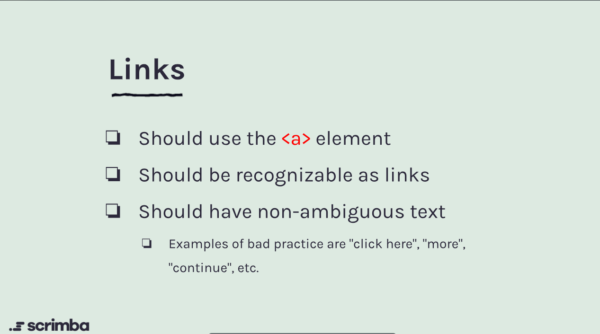
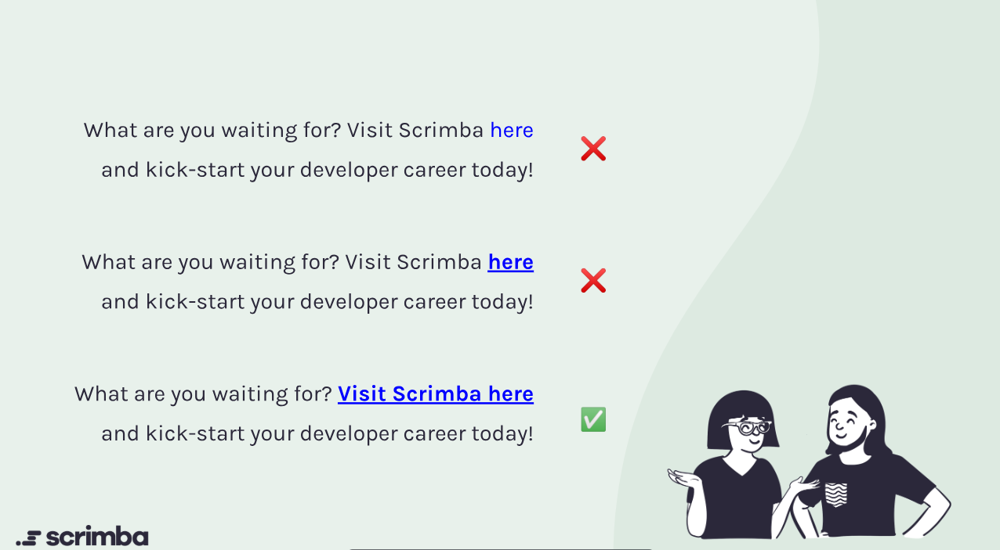

# Accessible Links

Links are a fundamental part of web navigation, and making them accessible ensures that all users can interact with your content effectively. Here are key considerations and best practices for creating accessible links:

## Best Practices for Creating Accessible Links

1. **Descriptive Link Text**: Use clear and descriptive text for your links. Avoid vague phrases like "click here" or "read more." Instead, provide context about the link's destination or purpose.

2. **Consistent Navigation**: Maintain a consistent structure and location for navigation links throughout your site. This helps users, especially those with cognitive disabilities, to predict where they will find important links.

3. **Keyboard Accessibility**: Ensure that all links can be accessed and activated using a keyboard alone. This includes providing visible focus indicators for keyboard users.

4. **Avoiding Link Overload**: Be mindful of the number of links on a page. Too many links can overwhelm users and make it difficult to find important content. Consider using headings and subheadings to organize content effectively.

5. **Use of ARIA Roles**: When appropriate, use ARIA (Accessible Rich Internet Applications) roles and properties to enhance the accessibility of links, especially in complex web applications.

## Examples of Accessible Links

- **Good**: "Learn more about our accessibility features."
- **Poor**: "Click here for more information."

## Common Mistakes to Avoid

- Using generic link text that does not provide context.
- Failing to ensure keyboard accessibility for all links.
- Overloading pages with too many links, making navigation difficult.

## Tools for Testing Link Accessibility

- Use accessibility evaluation tools like **axe DevTools** or **WAVE** to identify potential issues with link accessibility.
- Conduct user testing with individuals who have disabilities to gather feedback on link usability.

## Conclusion

By following these best practices and avoiding common mistakes, you can create accessible links that enhance the user experience for everyone. Regularly review and update your link structures to ensure ongoing accessibility compliance.

## Additional Resources

- [W3C: Accessible Rich Internet Applications (WAI-ARIA)](https://www.w3.org/WAI/ARIA/)
- [WebAIM: Creating Accessible Links](https://webaim.org/techniques/links/)
- [A11Y Project: Links](https://www.a11yproject.com/posts/2020-06-22-creating-accessible-links/)
