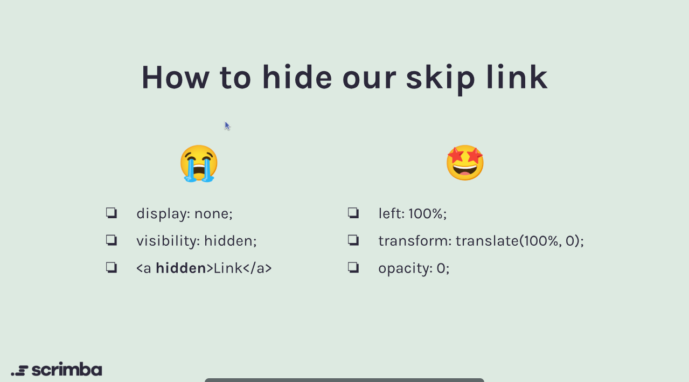

# Skip Navigation Link

## Introduction

A skip navigation link is a crucial accessibility feature that allows users, especially those using screen readers or keyboard navigation, to bypass repetitive content and navigate directly to the main content of a webpage. This is particularly important for users with disabilities who may find it challenging to navigate through extensive menus or links.

## Implementation

To implement a skip navigation link, follow these steps:
<!-- markdownlint-disable MD029 -->
1. **Create the Link**: Add a link at the top of your HTML document that points to the main content area. Use a clear and descriptive label, such as "Skip to main content."

```html
    <a href="#main-content" class="skip-link">Skip to main content</a>
```

2. **Identify the Main Content Area**: Ensure that the main content area has a corresponding ID that the skip link can target.

```html
  <main id="main-content">
    <!-- Main content goes here -->
  </main>
```

3. **Style the Link**: Use CSS to visually hide the skip link until it receives focus. This ensures that it is only visible to keyboard users.

```css
  .skip-link {
    position: absolute;
    top: -40px;
    left: 6px; /* Small offset from left edge */
    background: #000;
    color: #fff;
    padding: 8px;
    text-decoration: none;
    z-index: 100;
    transition: top 0.3s;
  }

  .skip-link:focus {
    top: 6px; /* Bring into view on focus */
  }
```
<!-- markdownlint-disable MD029 -->

Alternative hiding methods (choose one, but ensure the transition matches):

- Using `left`: Set `left: -9999px;` initially, then `left: 6px;` on focus, and `transition: left 0.3s;`.
- Using `transform`: Set `transform: translateY(-100%);` initially, then `transform: translateY(0);` on focus, and `transition: transform 0.3s;`.

Note: Avoid `display: none` or `visibility: hidden` as screen readers may skip these elements entirely.

## Best Practices

- **Positioning**: Place the skip link at the top of the page, before any other content, to ensure it is the first focusable element.
- **Visibility**: Ensure the skip link is visually hidden but still accessible to screen readers. Use techniques like `clip` or `absolute positioning` to achieve this.
- **Testing**: Test the skip link with various assistive technologies to ensure it behaves as expected.

## Conclusion

Skip navigation links are a simple yet effective way to enhance the accessibility of your web applications. By implementing them thoughtfully, you can significantly improve the user experience for individuals with disabilities.
