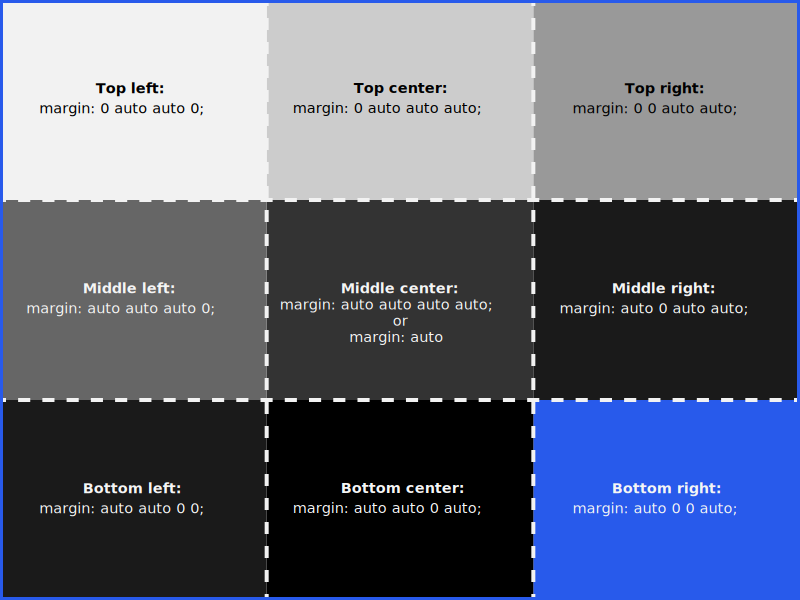
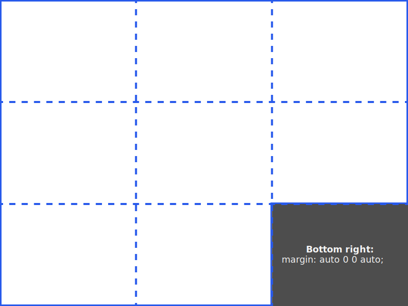

# Using `margin: auto` on Flex Items

> _Inspired by Kevin Powell’s CSS teaching style on Scrimba_

## Overview

`margin: auto` is a powerful tool for aligning flex items within a flex container. While the `gap` property spaces items evenly, `margin: auto` lets you push individual items to one side or corner, creating flexible layouts.

## Why Use `margin: auto`?

- Align a single item to one side (e.g., push a menu icon to the right)
- Separate groups of items within a flex container
- Achieve advanced layouts without extra wrappers or utility classes

## Example: Pushing a Flex Item to the Right

Suppose you want to push the menu icon to the far right of a navigation bar:

```css
.align-right {
    margin-left: auto; /* Takes up all available space on the left */
}
```

**Result:** The menu icon moves to the right, while other items stay on the left.

## How `margin: auto` Works in Flexbox

When you set a margin to `auto` on a flex item, it absorbs all available space in that direction. This can be used to align items to any side or corner of the container.

### Visual Reference: 9 Alignment Zones

Flexbox layouts can be thought of as having 9 zones:

- Top left, Top center, Top right
- Middle left, Middle center, Middle right
- Bottom left, Bottom center, Bottom right

You can use combinations of `margin-top: auto`, `margin-right: auto`, `margin-bottom: auto`, and `margin-left: auto` to move items into these zones.

```css
.flex-container {
    display: flex;
    flex-wrap: wrap;
}

.flex-item {
    margin-top: auto;    /* Pushes the item to the bottom */
    margin-right: auto;  /* Pushes the item to the left */
    margin-left: auto;   /* Pushes the item to the right */
    margin-bottom: auto; /* Pushes the item to the top */
}
```

## Quick Reference: Clock Analogy

Think of the container like a clock:

- 12 o'clock: Top center (`margin-top: auto`)
- 3 o'clock: Middle right (`margin-right: auto`)
- 6 o'clock: Bottom center (`margin-bottom: auto`)
- 9 o'clock: Middle left (`margin-left: auto`)

## Aligning to Corners

Combine two `auto` margins to move an item to a corner:

```css
.align-top-right {
    margin-top: auto;
    margin-left: auto;
}

.align-bottom-left {
    margin-bottom: auto;
    margin-right: auto;
}
```

## Shorthand Example

You can use the shorthand `margin` property. The order is: top, right, bottom, left.

> The diagram below shows all nine flexbox alignment zones and their corresponding margin shorthand values. Use this as a quick reference for positioning flex items with margin shorthand.



```css
.bottom-right-item {
    margin: auto 0 0 auto; /* bottom right corner */
}
```

> The highlighted zone below demonstrates how `margin: auto 0 0 auto;` positions a flex item in the bottom right corner.



## Learning Reflection

I found it surprising how versatile `margin: auto` is in flex layouts. It’s not just for centering—combining different sides lets you align items anywhere in the container, which is much cleaner than using extra wrappers or utility classes. This technique is especially useful for responsive navigation bars and dashboard layouts.

## Further Reading

- [CSS Tricks: A Complete Guide to Flexbox](https://css-tricks.com/snippets/css/a-guide-to-flexbox/)
- [MDN Web Docs: Flexbox](https://developer.mozilla.org/en-US/docs/Web/CSS/CSS_Flexible_Box_Layout/Basic_Concepts_of_Flexbox)
- [W3Schools: CSS Flexbox Items](https://www.w3schools.com/css/css3_flexbox_items.asp)

---
_Documented as part of the Scrimba Fullstack Path — Essential CSS module._
