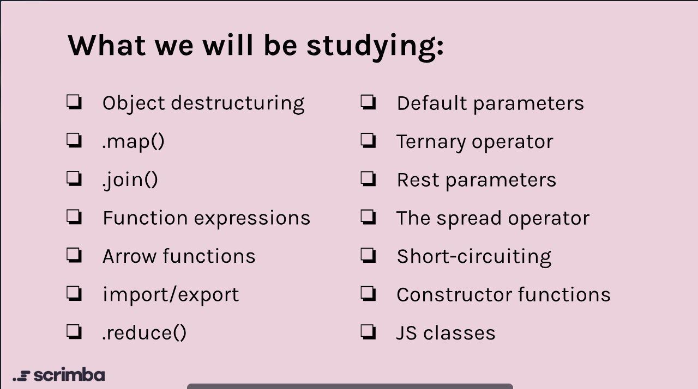
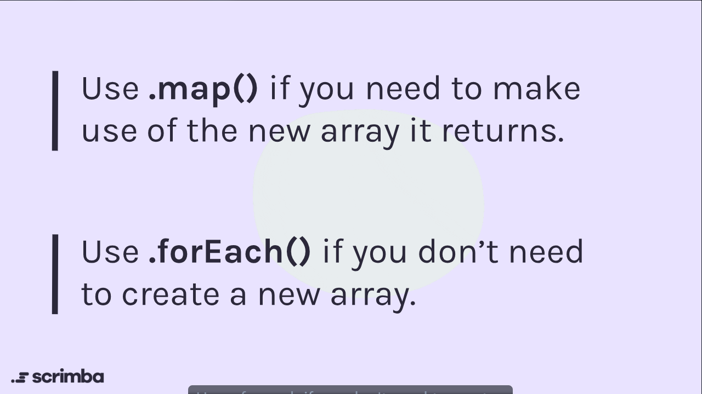
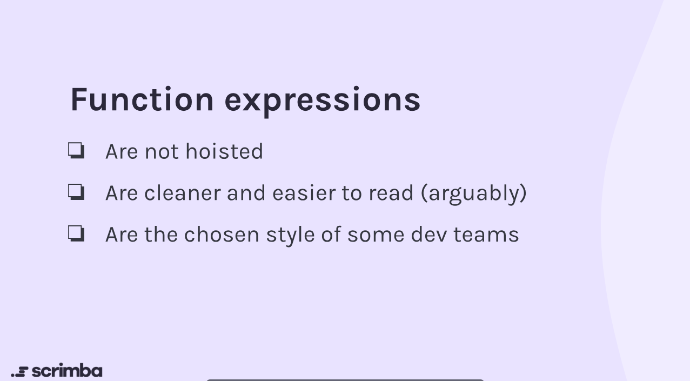

# Mini Projects — JavaScript Topics Reference

This document is a concise reference for the mini-projects in Section 4 of the Essential JavaScript course. Each topic includes a short overview, example(s), quick tips, references, and image placeholders/diagrams you can fill later.

> Use this as a quick lookup while building tiny projects or when you need to recall patterns in real work, Insha'Allah.



---

## Object Destructuring

Overview

- Object destructuring lets you extract properties from objects into distinct variables.

Example

```js
const user = { name: 'Aisha', age: 28, city: 'Cairo' };
const { name, age } = user; // name = 'Aisha', age = 28

// rename and default
const { city: hometown, country = 'Egypt' } = user; // hometown = 'Cairo', country = 'Egypt'
```

Tips

- Use destructuring in function parameters for named options: `function greet({name, city}) {}`
- Be careful with nested destructuring and missing properties — provide defaults.

Diagram

```text
 user object                 destructure => variables
 {name, age, city}  ---{name, age}-->  name, age
```

Image placeholder: ``

References

- MDN: <https://developer.mozilla.org/en-US/docs/Web/JavaScript/Reference/Operators/Destructuring_assignment>

---

## Array.prototype.map()

Overview

- `map()` transforms every element in an array and returns a new array with the transformed values.

Example

```js
const nums = [1, 2, 3];
const doubled = nums.map(n => n * 2); // [2, 4, 6]

// map with objects
const users = [{name: 'Ali', age:20}, {name:'Sara', age:25}];
const names = users.map(u => u.name); // ['Ali', 'Sara']
```

Tips

- Always return a new array — map does not mutate the original by design.
- Use `map()` when you have a 1:1 transformation for every element.

Diagram (input → map(fn) → output)

```text
 [a,b,c] --map(f)--> [f(a), f(b), f(c)]
```



References

- MDN: <https://developer.mozilla.org/en-US/docs/Web/JavaScript/Reference/Global_Objects/Array/map>

---

## Array.prototype.join()

Overview

- `join(separator)` converts an array into a string, inserting `separator` between items.

Example

```js
const parts = ['Hello', 'world'];
parts.join(' '); // 'Hello world'
['a', 'b', 'c'].join('-'); // 'a-b-c'
```

Tips

- Passing `''` concatenates without separators.
- Useful to build CSV-like strings from arrays.

Image placeholder: ``

References

- MDN: <https://developer.mozilla.org/en-US/docs/Web/JavaScript/Reference/Global_Objects/Array/join>

---

## For Loop Continue and Break

Overview

- `continue` skips to the next iteration of a loop, while `break` exits the loop entirely.

Example

```js
/* 
    Below is an array of objects representing expenses and refunds. 
    Positive amounts are expenses, negative amounts are refunds. 
    
    We want to find out how much money was spent in 2023. 
*/

const expensesAndRefunds = [
    { description: 'Groceries', amount: 50, year: 2023 },
    { description: 'Electronics', amount: -30, year: 2023 },
    { description: 'Dinner', amount: 40, year: 2023 },
    { description: 'Clothing', amount: 60, year: 2023 },
    { description: 'Entertainment', amount: 25, year: 2023 },
    { description: 'Rent', amount: -500, year: 2024 },
    { description: 'Utilities', amount: 100, year: 2024 },
    { description: 'Books', amount: 20, year: 2024 },
    { description: 'Fitness', amount: 30, year: 2024 },
    { description: 'Gifts', amount: 15, year: 2024 },
]

let totalSpent = 0
const cutoffDate = 2024

for (let i = 0; i < expensesAndRefunds.length; i++) {
    const currentExpenseOrRefund = expensesAndRefunds[i]
    
    if (currentExpenseOrRefund.year >= cutoffDate) {
        console.log(`Reached cutoff date, exiting loop`)
        break   
    }
    
    if (currentExpenseOrRefund.amount < 0) {
        console.log(`Skipping ${currentExpenseOrRefund.description} due to refund`)
        continue
    } 
    
    totalSpent += currentExpenseOrRefund.amount 
}


console.log(`Total amount spent on items in 2023: $${totalSpent}`)
```

Tips

- Use `continue` to skip unwanted cases without nesting code.
- Use `break` to exit loops early when a condition is met.

References

- MDN (break): <https://developer.mozilla.org/en-US/docs/Web/JavaScript/Reference/Statements/break>
- MDN (continue): <https://developer.mozilla.org/en-US/docs/Web/JavaScript/Reference/Statements/continue>
- MDN (for loop): <https://developer.mozilla.org/en-US/docs/Web/JavaScript/Reference/Statements/for>
- W3Schools (break/continue): <https://www.w3schools.com/js/js_loop_control.asp>

---

## The Dangers of innerHTML

Overview

- Using `innerHTML` to insert user-generated content can lead to security vulnerabilities (XSS attacks).

Example

```js
const filmInput = document.getElementById('film-input')
const addBtn = document.getElementById('add-btn')
const filmList = document.getElementById('film-list')

addBtn.addEventListener('click', function() {
/*
Challenge:
1. Find a way of adding an inputted film to the list 
   which does not allow malicious JavaScript to be executed.
2. Implement it. 
*/

const newFilm = document.createElement('div')
newFilm.classList.add('film-item')
newFilm.textContent = filmInput.value
filmList.appendChild(newFilm)

    // filmList.innerHTML += `
    //     <div class="film-item">${filmInput.value}</div>
    //     `
    // filmInput.value = ''
})
```

Tips

- Prefer `textContent` or `createElement` + `appendChild` for inserting user content.
- If you must use `innerHTML`, sanitize the input first using libraries like DOMPurify.

References

- OWASP XSS Prevention: <https://owasp.org/www-community/attacks/xss/>
- MDN: <https://developer.mozilla.org/en-US/docs/Web/API/Element/innerHTML>

---

## Function Expressions

Overview

- A function expression defines a function as part of an expression and can be anonymous or named. It can be assigned to variables.

Example

```js
// Function expression
const getSpendAlert = function(amount){
    return `Warning! You just spent £${amount}!`
}
```

```js
// Function declaration
function getSpendAlert(amount) {
    return `Warning! You just spent £${amount}!`
}
```

Tips

- Function expressions are not hoisted like function declarations.
- Are cleaner and easier to read (arguably)
- Are the chosen style of some dev teams



References

- MDN: <https://developer.mozilla.org/en-US/docs/Web/JavaScript/Guide/Functions#function_expressions>

---

## Arrow Functions

Overview

- Shorter syntax for function expressions. They inherit `this` from their lexical scope and do not have their own `arguments` object.

Example

```js
const add = (a, b) => a + b;
const square = x => x * x;

// multiline body
const stats = arr => {
 const sum = arr.reduce((s, v) => s + v, 0);
 return { sum, avg: sum / arr.length };
};
```

Tips

- Avoid arrow functions as object methods when you rely on `this`.

References

- MDN: <https://developer.mozilla.org/en-US/docs/Web/JavaScript/Reference/Functions/Arrow_functions>

---

## import / export (ES Modules)

Overview

- ES Modules allow you to split code into files and import/export values. Use `export` to expose and `import` to consume.

Example

```js
// utils.js
export function sum(a, b) { return a + b }
export const PI = 3.14159;

// index.js
import { sum, PI } from './utils.js';
console.log(sum(2, 3), PI);
```

Default export

```js
// module.js
export default function say() { console.log('hello') }

// importDefault.js
import say from './module.js';
```

Tips

- Use named exports for utilities, default export for a single primary value.
- Remember file extension or module resolution when using Node/Esm bundlers.

References

- MDN: <https://developer.mozilla.org/en-US/docs/Web/JavaScript/Guide/Modules>

---

## Array.prototype.reduce()

Overview

- `reduce()` aggregates an array into a single value (sum, object, map, etc.) by applying a reducer function.

Example

```js
const nums = [1,2,3,4];
const sum = nums.reduce((acc, val) => acc + val, 0); // 10

// group by property
const people = [{age:20},{age:30},{age:20}];
const countByAge = people.reduce((acc, p) => {
 acc[p.age] = (acc[p.age] || 0) + 1;
 return acc;
}, {}); // { '20': 2, '30': 1 }
```

Tips

- Provide an initial value to avoid surprises (especially for empty arrays).
- `reduce()` is powerful but sometimes less readable than specialized methods — comment the intention.

Diagram

```text
 acc -> reducer --> newAcc -> reducer --> result
```

References

- MDN: <https://developer.mozilla.org/en-US/docs/Web/JavaScript/Reference/Global_Objects/Array/reduce>

---

## Default Parameters

Overview

- Functions can have default parameter values used when arguments are `undefined`.

Example

```js
function greet(name = 'friend') {
 return `Hello, ${name}`;
}
greet(); // 'Hello, friend'
```

Tips

- Defaults evaluate at call time (can use expressions or functions), and only apply for `undefined`.

References

- MDN: <https://developer.mozilla.org/en-US/docs/Web/JavaScript/Reference/Functions/Default_parameters>

---

## Ternary Operator

Overview

- Short inline conditional expression: `condition ? exprIfTrue : exprIfFalse`.

Example

```js
const access = user.isAdmin ? 'admin' : 'guest';
// nested (use sparingly)
const status = score >= 90 ? 'A' : score >= 80 ? 'B' : 'C';
```

Tips

- Good for short expressions. Prefer `if`/`else` for complex branches.

References

- MDN: <https://developer.mozilla.org/en-US/docs/Web/JavaScript/Reference/Operators/Conditional_Operator>

---

## Rest Parameters

Overview

- `...rest` collects remaining function arguments into an array.

Example

```js
function sumAll(...nums) {
 return nums.reduce((s, n) => s + n, 0);
}
sumAll(1,2,3); // 6
```

Tips

- Rest must be last parameter in a function signature.

References

- MDN: <https://developer.mozilla.org/en-US/docs/Web/JavaScript/Reference/Functions/rest_parameters>

---

## Spread Operator

Overview

- `...` spreads elements of arrays or properties of objects.

Examples

```js
const a = [1,2];
const b = [0, ...a, 3]; // [0,1,2,3]

const obj = {x:1};
const obj2 = {...obj, y:2}; // {x:1, y:2}
```

Tips

- Use to copy arrays/objects (shallow copy), combine arrays, or convert NodeList to array: `[...]`.

References

- MDN: <https://developer.mozilla.org/en-US/docs/Web/JavaScript/Reference/Operators/Spread_syntax>

---

## Short-circuiting (|| and &&)

Overview

- Logical OR (`||`) and AND (`&&`) return the value (not strictly boolean) of their operands — useful for defaults and conditional evaluation.

Examples

```js
const name = user.name || 'Guest'; // default if falsy
isLoggedIn && showDashboard(); // call if truthy
```

Tips

- With modern JS consider using nullish coalescing `??` to treat only `null`/`undefined` as missing (not `''` or `0`).

References

- MDN (Logical operators): <https://developer.mozilla.org/en-US/docs/Web/JavaScript/Reference/Operators/Logical_Operators>
- MDN (Nullish coalescing): <https://developer.mozilla.org/en-US/docs/Web/JavaScript/Reference/Operators/Nullish_coalescing_operator>

---

## Constructor Functions

Overview

- Older pattern to create similar objects via `function` used with `new`. Sets up prototype connections.

Example

```js
function Person(name, age) {
 this.name = name;
 this.age = age;
}
Person.prototype.greet = function() { return `Hi, I'm ${this.name}` };

const p = new Person('Omar', 32);
```

Tips

- Prefer ES6 classes for clarity, but understanding constructor functions helps read legacy code.

References

- MDN: <https://developer.mozilla.org/en-US/docs/Web/JavaScript/Reference/Functions/constructor>

---

## JavaScript Classes

Overview

- Syntactic sugar over prototype-based inheritance. Use `class` and `constructor`, `extends` for subclasses.

Example

```js
class Animal {
 constructor(name) { this.name = name }
 speak() { return `${this.name} makes a noise.` }
}

class Dog extends Animal {
 speak() { return `${this.name} barks.` }
}

const d = new Dog('Rex');
d.speak(); // 'Rex barks.'
```

Tips

- Methods defined in classes are on the prototype. Use `static` for class-level helpers.

References

- MDN: <https://developer.mozilla.org/en-US/docs/Web/JavaScript/Reference/Classes>

---

## Putting it together — mini-project ideas

- Console utilities: CLI-like utilities using destructuring, defaults, rest/spread and map/reduce for data processing.
- Small UI widgets: use import/export to split logic, classes for component-like state, arrow functions for event handlers.
- Data transformations: practice `map`, `reduce`, `join`, and `spread` to convert arrays of objects into CSV/HTML lists.

---

## Further reading & learning resources

- MDN JavaScript Guide: <https://developer.mozilla.org/en-US/docs/Web/JavaScript/Guide>
- JavaScript Info: <https://javascript.info>
- Eloquent JavaScript (book): <https://eloquentjavascript.net/>

---

If you'd like, I can:

- add small mini-project templates for each topic (starter files), or
- create short console exercises (with tests) for practice.

Image checklist: create `courses/07-essential-javaScript/04-mini-projects/images/` and add the PNGs for the placeholders above.
