<!-- markdownlint-disable MD024 -->
# APIs and Asynchronous JavaScript

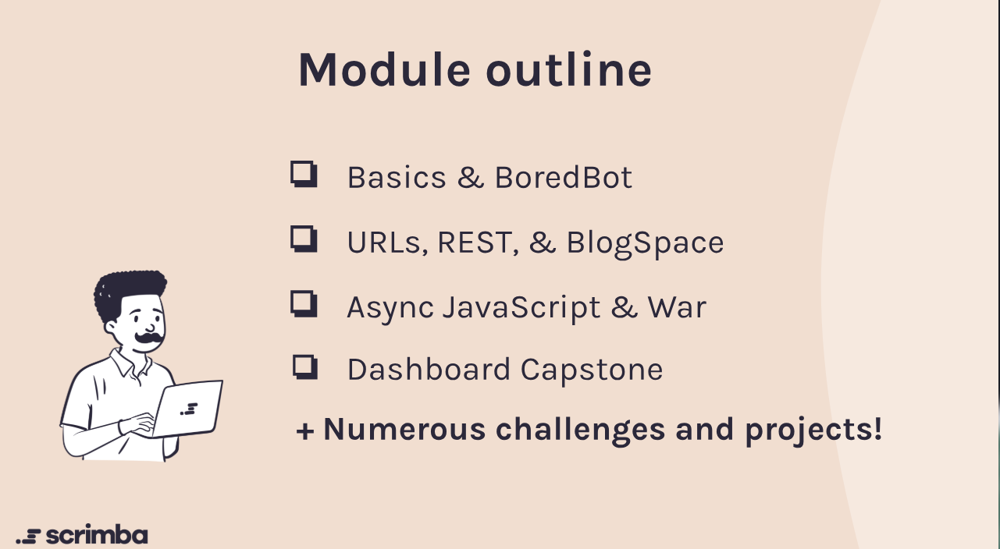

## Course Overview

Welcome to the world of **APIs and Asynchronous JavaScript**! This module marks a pivotal transition from working with local, static data to accessing real, dynamic information from servers across the globe.

Until now, data has likely lived directly in your code—stored in objects and arrays that reset with every refresh. But real applications don't work that way. They interact with databases, fetch live data, and communicate with external services. This is where **APIs** (Application Programming Interfaces) become essential.

Throughout this course, you'll learn how to:

- Fetch data from external APIs using modern JavaScript
- Handle asynchronous operations with promises and async/await
- Send requests and interact with RESTful APIs
- Build real-world projects that pull data from multiple sources
- Understand the client-server relationship fundamental to full-stack development

By mastering APIs and async JavaScript, you're not just learning a new skill—you're opening the door to building much more interesting, dynamic, and professional applications. Plus, you'll be well-prepared for the journey toward becoming a full-stack developer.

**Instructor:** Bob Ziroll  
**Course Projects:** BoredBot, BlogSpace, War Card Game, Personal Dashboard

---

## Table of Contents

1. [What is an API?](#what-is-an-api)
2. [Request-Response Cycle](#request-response-cycle)
3. [What is JSON?](#json-data)
4. [Understanding Clients and Servers](#clients--servers)
5. [Request-Response Cycle](#request-response-cycle)
6. [JSON Data](#json-data)
7. [Asynchronous JavaScript](#asynchronous-javascript)
8. [HTTP Requests](#http-requests)
9. [The Fetch API - Making HTTP Requests](#the-fetch-api---making-http-requests)
10. [Working with JSON Data](#working-with-json-data)
11. [REST](#rest)
12. [Promises and Asynchronous JavaScript](#promises-and-asynchronous-javascript)
13. [Error Handling in Async Operations](#error-handling-in-async-operations)
14. [Async/Await Syntax](#asyncawait-syntax)
15. [Working with Multiple APIs](#working-with-multiple-apis)
16. [Course Projects](#course-projects)

---

## What is an API?

### Understanding Application Programming Interfaces

An **API** (Application Programming Interface) is a set of rules and protocols that allows different software applications to communicate with each other. APIs define how requests for data or services should be made, what data formats to use, and how responses will be structured.

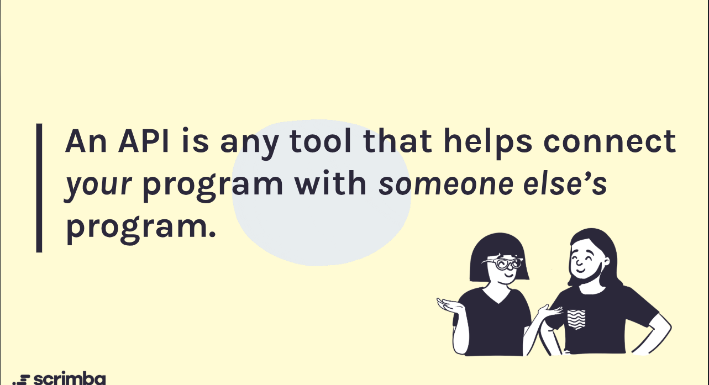

### Description

APIs act as intermediaries between clients (like web browsers or mobile apps) and servers (where data and services are hosted). When you interact with an application that fetches data from the internet, it's likely using an API to request that data.

APIs can be public (open for anyone to use) or private (restricted access). They often require authentication, such as API keys, to ensure secure access.

**Let's put it this way: an API is any tool that helps connect your program to someone else's program.**

### Code Examples

**Generic Example:**

```javascript
// Example of making a request to a public API
fetch('https://api.example.com/data')
    .then(response => response.json())
    .then(data => {
        console.log(data);
    });
```

**From BoredBot Project:**

```javascript
// Fetching a random activity from the Bored API
function getActivityIdea() {
    fetch("https://apis.scrimba.com/bored/api/activity")
        .then(res => res.json())
        .then(data => {
            document.getElementById("idea").textContent = data.activity
            document.body.classList.add("fun")
            document.getElementById("title").textContent = "🦾 HappyBot🦿"
        })
}

document.getElementById("bored-button").addEventListener("click", getActivityIdea)
```

### Learning Resources

- [What is an API? (FreeCodeCamp)](https://www.freecodecamp.org/news/what-is-an-api-in-english-please-b880a3214a82/)
- [MDN: Introduction to APIs](https://developer.mozilla.org/en-US/docs/Learn/JavaScript/Client-side_web_APIs/Introduction)
- [RESTful API Tutorial](https://restfulapi.net/)

## Clients & Servers

### Description

The **client-server model** is the foundational architecture of the web, where clients (like browsers) request resources from servers (where data and services are hosted). APIs facilitate this communication by defining how requests and responses should be structured.

### What is a client?

A **client** is any application or device that requests services or resources from a server. In web development, the most common client is a web browser (like Chrome, Firefox, or Safari) that users interact with to access websites and web applications. Other examples of clients include mobile apps, desktop applications, and even IoT devices.

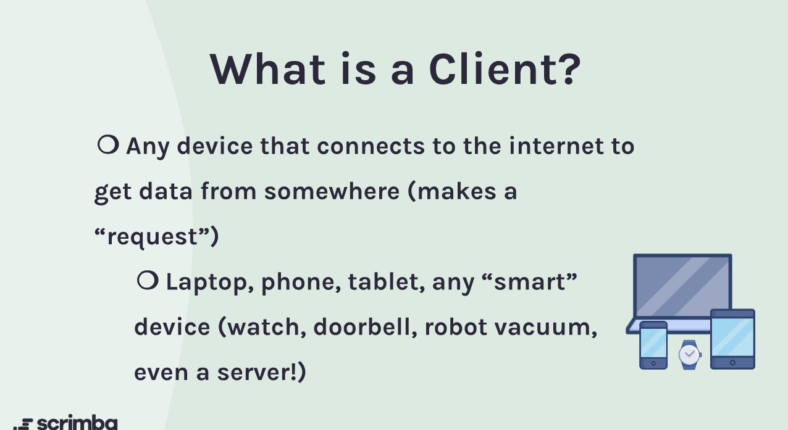

### What is a server?

A **server** is a powerful computer or system that hosts data, applications, and services, making them accessible to clients over a network (like the emails). Servers respond to requests from clients by providing the requested resources, such as web pages, images, or data from databases. Examples of servers include web servers (like Apache or Nginx), database servers (like MySQL or MongoDB), and application servers that run backend code.

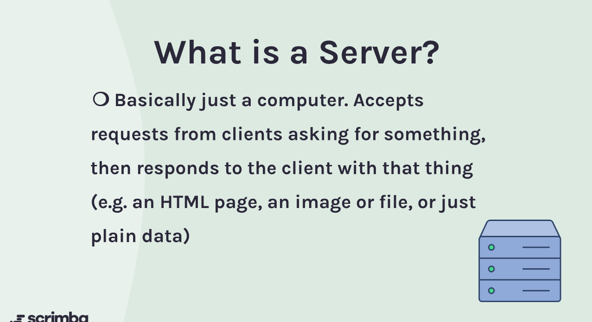

---

## Request-Response Cycle

### Description

The **request-response cycle** is the fundamental process through which clients and servers communicate over the internet. When a client wants to access a resource or service, it sends an HTTP request to the server. The server processes this request and sends back an HTTP response containing the requested data or an error message if something goes wrong.

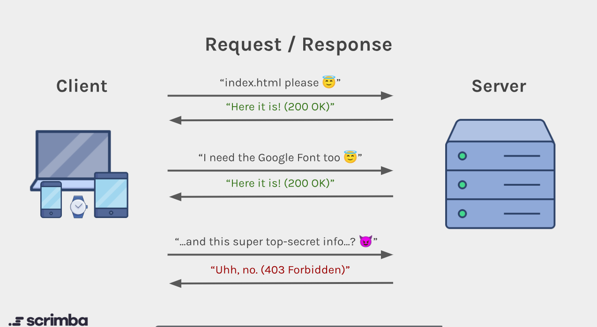

### What's a request?

A **request** is a message sent by a client to a server, asking for a specific resource (like HTML page, image, authentication request) or service (like data retrieval). This message typically includes the HTTP method (like GET, POST, etc.), the URL of the resource, headers (which provide additional information about the request), and sometimes a body (which contains data being sent to the server).

**Common status codes include:**

- **200 OK**: The request was successful.
- **404 Not Found**: The requested resource could not be found.
- **500 Internal Server Error**: The server encountered an error while processing the request.
- **401 Unauthorized**: Authentication is required and has failed or has not yet been provided.
- **403 Forbidden**: The server understood the request but refuses to authorize it.

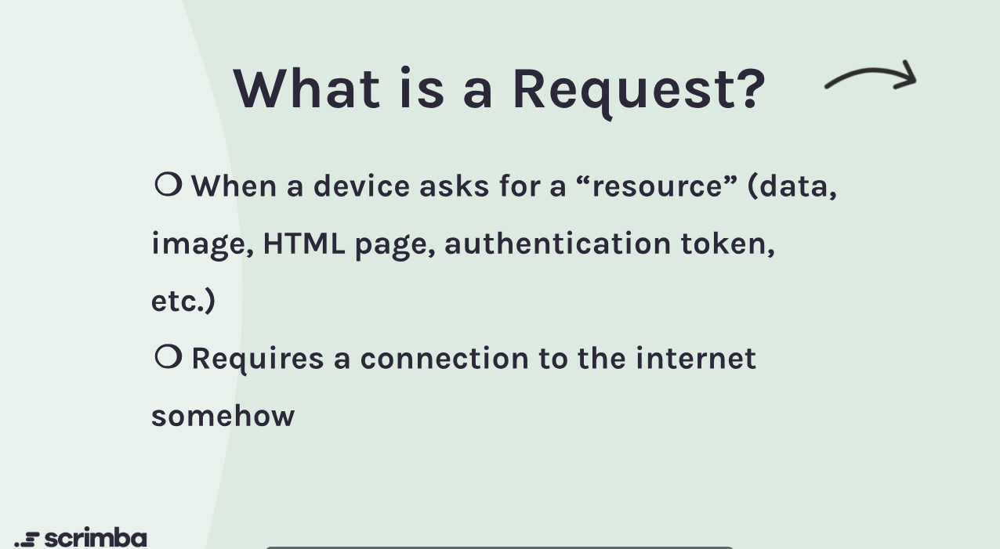

### What's a response?

A **response** is the message sent by a server back to the client after processing a request. This message includes a status code (indicating whether the request was successful or if there was an error), headers (providing metadata about the response), and a body (which contains the requested data or information). The response allows the client to understand the outcome of its request and access the resources it needs.


---

## JSON Data

### Understanding JavaScript Object Notation

**JSON** (JavaScript Object Notation) is a lightweight data interchange format that is easy for humans to read and write, and easy for machines to parse and generate. It is widely used for transmitting data between a server and a web application.

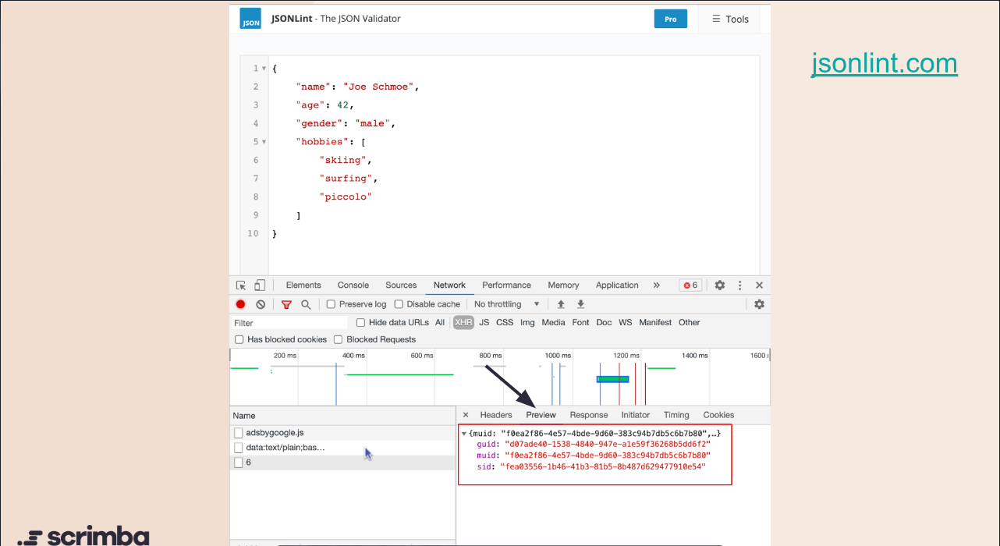

### Description

JSON represents data as key-value pairs, similar to JavaScript objects. It supports various data types, including strings, numbers, booleans, arrays, and nested objects. JSON is language-independent but uses conventions familiar to programmers of the C family of languages.

When working with APIs, data is often sent and received in JSON format. JavaScript provides built-in methods like `JSON.stringify()` to convert JavaScript objects to JSON strings and `JSON.parse()` to convert JSON strings back into JavaScript objects.

### Code Examples

**Generic Example:**

```javascript
// JSON data example
{
    "name": "John Doe",
    "age": 30,
    "isAdmin": false,
    "hobbies": ["reading", "gaming", "coding"]
}
```

**From BoredBot Project (people.json):**

```javascript
[
    {
        "name": "Sarah",
        "age": 35,
        "birthplace": "Scotland",
        "hobbies": [
            "violin",
            "singing",
            "crafting"
        ]
    },
    {
        "name": "Michael",
        "age": 56,
        "birthplace": "South Africa",
        "hobbies": [
            "skateboarding",
            "guitar"
        ]
    }
]
```

**Tip:** To see JSON data in action while browsing the web:

1. Open any website.
2. Inspect the network requests.
3. Filter by XHR or Fetch.
4. Click on any request to see JSON data being transferred!

---

## Asynchronous JavaScript

### Understanding Asynchronous Operations

**Asynchronous JavaScript** allows your code to perform long-running tasks without blocking the main thread, enabling a more responsive user experience.

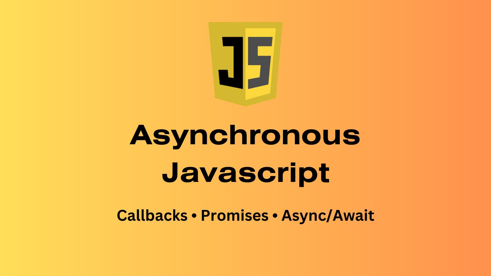

### Description

Asynchronous JavaScript is a way of writing JavaScript code so that long-running tasks (like fetching data from a server, reading files, or waiting for a timer) don’t block the execution of other code. This allows your application to remain responsive and efficient, even when performing operations that take time to complete.

JavaScript is single-threaded, it can only do one thing at a time, but asynchronous programming allows it to start a task, continue running other code, and handle the result later when the task finishes.

#### Synchronous vs. Asynchronous

**Synchronous programming** means each operation must complete before the next one starts. This can lead to unresponsive programs if a long-running task is executed. For example, a synchronous function that generates large prime numbers can block the main thread, making the program/website unresponsive.

**Asynchronous programming** allows a website to start a long-running operation and continue executing other tasks. Once the operation completes, the browser is notified with the result. This is achieved using various methods such as callbacks, promises, and async/await.

### Code Examples

**Generic Example:**

```javascript
// Synchronous example (blocking)
function generatePrimes(limit) {
    const primes = [];
    for (let num = 2; num <= limit; num++) {
        let isPrime = true;
        for (let i = 2; i <= Math.sqrt(num); i++) {
            if (num % i === 0) {
                isPrime = false;
                break;
            }
        }
        if (isPrime) primes.push(num);
    }
    return primes;
}
console.log(generatePrimes(100000)); // Blocks execution until done

// Asynchronous example (non-blocking)
function fetchData(url) {
    return new Promise((resolve, reject) => {
        setTimeout(() => {
            resolve(`Data from ${url}`);
        }, 2000); // Simulate a 2-second network request
    });
}
fetchData('https://api.example.com/data')
    .then(data => {
        console.log(data); // Logs after 2 seconds, without blocking
    });
```

**From the boredbot project (Aside):**

```javascript
console.log("The first console log") // Logs immediately

fetch("https://dog.ceo/api/breeds/image/random")
    .then(response => response.json())
    .then(data => console.log(data)) // Logs after the fetch completes without blocking

console.log("The second console log") // Also logs immediately

for (let i = 0; i < 100; i++) {
    console.log("I'm inside the for loop") // Logs immediately 100 times
}
```

### Learning Resources

- [MDN: Asynchronous JavaScript](https://developer.mozilla.org/en-US/docs/Learn/JavaScript/Asynchronous)
- [JavaScript.info: Asynchronous Programming](https://javascript.info/async)
- [FreeCodeCamp: Asynchronous JavaScript Explained](https://www.freecodecamp.org/news/asynchronous-javascript-explained-with-examples/)

---

## HTTP Requests

### Understanding HTTP and Request Components

**HTTP** (HyperText Transfer Protocol) is the agreed-upon standard way of transferring text and hypermedia over the internet. It's the foundation of data communication on the web, defining how requests and responses should be formatted and transmitted.

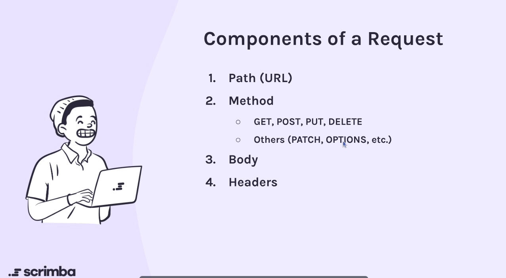

### Description

HTTP is a **protocol**—an agreed-upon standard way of doing something. Just like protocols in everyday life (such as "what's the protocol for entering a building?"), HTTP defines the rules for how data should be transferred between clients and servers on the web.

Every time you see a URL starting with `http://` or `https://` (the secure version), you're using the HyperText Transfer Protocol. The "S" in HTTPS stands for "secure," providing encryption for safer data transmission.

#### Components of an HTTP Request

Every HTTP request consists of four main components:

1. **Path (URL)**: The address where the resource lives. This tells the server exactly what resource you're requesting. URLs follow a specific structure including the protocol (scheme), host, path, query parameters, and sometimes fragments.

2. **Method**: Defines the type of action you want to perform. Common methods include:
   - **GET**: Retrieve data from the server (most common, used by default in `fetch()`)
   - **POST**: Send new data to the server
   - **PUT**: Update existing data on the server
   - **DELETE**: Remove data from the server
   - Others: **PATCH**, **OPTIONS**, etc.

3. **Body**: Contains data you're sending to the server (typically used with POST, PUT, and PATCH requests). GET requests generally don't have a body.

4. **Headers**: Meta-information about the request, such as:
   - What browser or operating system is making the request
   - Authentication tokens for protected resources
   - Content type of data being sent
   - Many other metadata fields

### URL Structure

A complete URL consists of multiple parts that work together to identify and locate resources:

```text
https://example.com:443/path/to/resource?query=value#fragment
│     │ │           │   │                │           │
│     │ │           │   │                │           └─ Fragment (section identifier)
│     │ │           │   │                └─ Query (parameters)
│     │ │           │   └─ Path (location of resource)
│     │ │           └─ Port (optional, default 443 for HTTPS)
│     │ └─ Host (domain)
│     └─ Scheme/Protocol (https://)
```

### Code Examples

**Generic Example:**

```javascript
// Simple GET request (default method)
fetch("https://apis.scrimba.com/jsonplaceholder/posts")
    .then(response => response.json())
    .then(data => {
        console.log(data); // Array of posts
    });

// The request above includes:
// - Path: "https://apis.scrimba.com/jsonplaceholder/posts"
// - Method: GET (default when not specified)
// - Headers: Automatically set by the browser
// - Body: None (GET requests typically don't have a body)
```

**From Course Challenge:**

```javascript
// Challenge: Fetch blog posts from JSONPlaceholder API
fetch("https://apis.scrimba.com/jsonplaceholder/posts")
    .then(res => res.json())
    .then(data => {
        console.log(data);
    });

// What HTTP worked behind the scenes:
// - Protocol: HTTPS (secure)
// - Method: GET (retrieving data)
// - Response: JSON array of blog posts
```

**Understanding URL Components:**

```javascript
// Breaking down a complete URL
const url = "https://api.example.com:443/users/123?include=posts#profile";

// Components:
// - Scheme/Protocol: "https://"
// - Host: "api.example.com"
// - Port: ":443" (default for HTTPS, often omitted)
// - Path: "/users/123"
// - Query: "?include=posts" (parameters)
// - Fragment: "#profile" (section identifier)
```

### Key Takeaways

- **HTTP methods are conventionally capitalized** (GET, POST, PUT, DELETE)
- **GET is the default method** when using `fetch()` without additional options
- **HTTPS is more secure** than HTTP and should be used for sensitive data
- **URLs have multiple components** that work together to identify resources
- **Headers carry metadata** about requests and responses
- **The body contains data** you're sending (for POST, PUT, PATCH requests)

### Learning Resources

- [MDN: HTTP Overview](https://developer.mozilla.org/en-US/docs/Web/HTTP/Overview)
- [http.dev: HTTP Methods](https://http.dev/methods)
- [GeneralistProgrammer: HTTP Status Codes Reference](https://generalistprogrammer.com/cheatsheets/http-status-codes)
- [GeeksforGeeks: Components of a URL](https://www.geeksforgeeks.org/computer-networks/components-of-a-url/)
- [Dev.to: A Comprehensive Guide to HTTP Basics, Methods, Headers, and More](https://dev.to/devcorner/a-comprehensive-guide-to-http-basics-methods-headers-and-more-27p9)

---

## The Fetch API - Making HTTP Requests

### Introduction to Fetching Data

The **Fetch API** provides a modern, promise-based way to make HTTP requests in JavaScript. It's the primary tool for communicating with servers and retrieving data from APIs.


### Description

The `fetch()` function initiates a network request to a specified URL and returns a Promise that resolves to the Response object. This is your gateway to accessing data from external sources—whether it's getting a random activity idea, fetching weather information, or pulling down cryptocurrency prices.

The basic pattern involves:

1. Calling `fetch()` with a URL
2. Converting the response to JSON
3. Working with the returned data

### Code Examples

**Generic Example:**

```javascript
// Basic fetch request
fetch('https://api.example.com/data')
    .then(response => response.json())
    .then(data => {
        console.log(data);
    });
```

**From BoredBot Project:**

```javascript
// Fetching a random activity from the Bored API
function getActivityIdea() {
    fetch("https://apis.scrimba.com/bored/api/activity")
        .then(res => res.json())
        .then(data => {
            document.getElementById("idea").textContent = data.activity
            document.body.classList.add("fun")
            document.getElementById("title").textContent = "🦾 HappyBot🦿"
        })
}

document.getElementById("bored-button").addEventListener("click", getActivityIdea)
```

### Learning Resources

- [MDN: Using Fetch](https://developer.mozilla.org/en-US/docs/Web/API/Fetch_API/Using_Fetch)
- [JavaScript.info: Fetch](https://javascript.info/fetch)
- [Web.dev: Introduction to Fetch](https://web.dev/introduction-to-fetch/)
- [Bored API Documentation](https://www.boredapi.com/)

---

## Working with JSON Data

### Understanding JavaScript Object Notation

**JSON** (JavaScript Object Notation) is the standard format for data exchange between clients and servers. It's lightweight, human-readable, and perfectly suited for JavaScript applications.


### Description

When you receive data from an API, it typically comes in JSON format. The response from `fetch()` needs to be parsed using the `.json()` method, which returns another Promise containing the parsed JavaScript object.

JSON data structures mirror JavaScript objects and arrays, making them natural to work with. However, JSON is always a string format until it's parsed, and it follows strict syntax rules (double quotes, no trailing commas, etc.).

### Code Examples

**Generic Example:**

```javascript
// Parsing JSON response
fetch('https://api.example.com/user/123')
    .then(response => response.json())
    .then(user => {
        console.log(user.name);
        console.log(user.email);
    });

// Sample JSON structure
const jsonData = {
    "name": "John Doe",
    "email": "john@example.com",
    "posts": [
        { "id": 1, "title": "First Post" },
        { "id": 2, "title": "Second Post" }
    ]
};
```

**From BlogSpace Project:**

```javascript
// Fetching and working with an array of blog posts
fetch("https://apis.scrimba.com/jsonplaceholder/posts")
    .then(res => res.json())
    .then(data => {
        postsArray = data.slice(0, 5) // Take first 5 posts
        renderPosts()
    })

function renderPosts() {
    let html = ""
    for (let post of postsArray) {
        html += `
            <h3>${post.title}</h3>
            <p>${post.body}</p>
            <hr />
        `
    }
    document.getElementById("blog-list").innerHTML = html
}
```

### Learning Resources

- [MDN: Working with JSON](https://developer.mozilla.org/en-US/docs/Learn/JavaScript/Objects/JSON)
- [JSON.org: Official Specification](https://www.json.org/)
- [JavaScript.info: JSON Methods](https://javascript.info/json)
- [JSONPlaceholder: Free Fake API](https://jsonplaceholder.typicode.com/)

---

## REST

### Understanding RESTful Architecture

**REST** (Representational State Transfer) is a design pattern that provides a standardized way for clients and servers to communicate. While the formal name sounds complex, the concept is straightforward: REST defines principles that make web services consistent, predictable, and scalable.

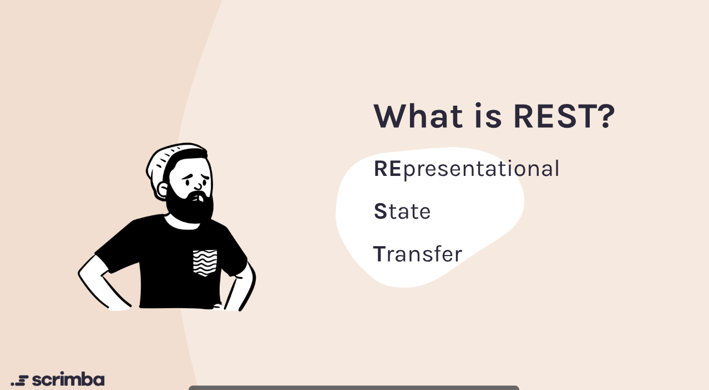

### Description

#### What Makes an API RESTful?

REST is built on a fundamental principle: **separation of client and server**. In a RESTful architecture:

- **Servers provide data** (usually in JSON format)
- **Clients handle presentation** (how that data is displayed)

This separation is powerful because it allows any type of client—whether it's a web browser, mobile app, smartwatch, or even a smart refrigerator—to consume the same API. The server doesn't care how the client displays the data; it simply sends the requested information in a standardized format.

#### REST vs. Server-Side Rendering

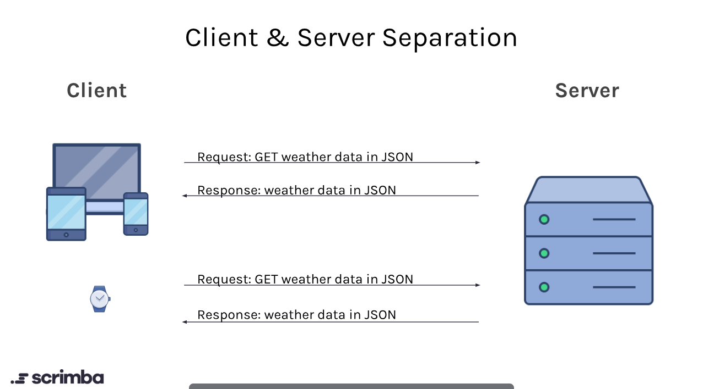

To understand REST better, consider how a non-RESTful website might work:

**Traditional Approach (Server-Side Rendering):**

- Client requests `weather.com`
- Server builds a complete HTML page with weather data embedded
- Server sends the entire rendered page back
- This works for browsers, but not for apps or other devices

**RESTful Approach:**

- Client requests weather data from API
- Server responds with just the data (JSON)
- Client decides how to display it (browser renders HTML, app shows native UI, smartwatch shows simplified view)
- Same API serves all types of clients

This is why you'll often see modern websites make separate requests for data after the page loads—they're using RESTful APIs to fetch information dynamically.

#### HTTP Methods in REST

REST uses HTTP methods to define operations on resources. Think of resources as "things" your API manages (users, posts, products, etc.):

- **GET**: Retrieve data from the server ("Read")
- **POST**: Send new data to create a resource ("Create")
- **PUT/PATCH**: Update existing data ("Update")
- **DELETE**: Remove data ("Delete")

These four methods form the CRUD operations (Create, Read, Update, Delete) that most applications need.

#### Request Configuration for POST

When making POST requests, you need to configure the fetch options with:

1. **method**: Specifies the HTTP method ("POST")
2. **body**: The data you're sending (converted to JSON string)
3. **headers**: Metadata about your request, especially `Content-Type: application/json` to tell the server you're sending JSON data

#### RESTful API Design

One of the most powerful aspects of REST is its **standardized URL structure** that makes APIs intuitive and predictable. Well-designed RESTful APIs follow consistent patterns that developers can understand immediately.


##### Statelessness

RESTful servers are **stateless**, meaning they don't maintain memory of previous requests. Each request must contain all the information the server needs to fulfill it. After sending a response, the server "forgets" about that interaction. If the client needs the server to know something, it must send that information with every request.

##### Resource-Based URLs

RESTful URLs represent **resources** (nouns like "bikes", "users", "posts") rather than actions (verbs). The HTTP method defines the action, while the URL identifies the resource.

**URL Patterns:**

Using a fictional bike shop API (`https://api.mikesbikes.com`) as an example:

**Collection Endpoints** (plural nouns):

- `GET /bikes` - Retrieve all bikes (returns an array)
- `POST /bikes` - Create a new bike (add to collection)

**Individual Resource Endpoints** (with ID):

- `GET /bikes/123` - Retrieve bike with ID 123 (returns single object)
- `PUT /bikes/123` - Update bike with ID 123
- `DELETE /bikes/123` - Remove bike with ID 123

**Key Design Principles:**

1. **Use nouns, not verbs**: URLs should contain only resource names
   - ✅ Good: `GET /bikes`
   - ❌ Bad: `GET /get-bikes` or `GET /getBikes`

2. **Collections return arrays**: Endpoints ending in plural nouns return collections
   - `GET /bikes` → `[{bike1}, {bike2}, {bike3}]`

3. **IDs return single resources**: Endpoints with IDs return individual items
   - `GET /bikes/42` → `{id: 42, name: "Mountain Bike", price: 599}`

4. **Methods indicate actions**: The HTTP method tells you what's happening
   - POST to `/bikes` = creating a new bike
   - POST to `/bikes/42` doesn't make sense (that bike already exists)
   - DELETE to `/bikes` = dangerous (deletes entire collection)
   - DELETE to `/bikes/42` = safe (removes one specific bike)

5. **Predictable patterns**: Once you understand one endpoint, you understand them all
   - If `/bikes` works a certain way, `/users` follows the same pattern
   - Consistency across your entire API

**Why This Matters:**

As a frontend developer consuming APIs, you can often guess endpoint URLs without checking documentation. When you eventually build your own APIs, following these conventions makes them easier for others to use and maintain.

### Code Examples

**Generic Example:**

```javascript
// GET request (default)
fetch('https://api.example.com/posts')
    .then(res => res.json())
    .then(data => console.log(data));

// POST request
const newPost = {
    title: "My New Post",
    body: "This is the content",
    userId: 1
};

fetch('https://api.example.com/posts', {
    method: "POST",
    headers: {
        "Content-Type": "application/json"
    },
    body: JSON.stringify(newPost)
})
    .then(res => res.json())
    .then(data => console.log(data));
```

**From BlogSpace Project:**

```javascript
// Creating a new blog post with POST request
form.addEventListener("submit", function(e) {
    e.preventDefault()
    const postTitle = titleInput.value
    const postBody = bodyInput.value
    const data = {
        title: postTitle,
        body: postBody
    }
    
    const options = {
        method: "POST",
        body: JSON.stringify(data),
        headers: {
            "Content-Type": "application/json"
        }
    }
    
    fetch("https://apis.scrimba.com/jsonplaceholder/posts", options)
        .then(res => res.json())
        .then(post => {
            postsArray.unshift(post) // Add to beginning of array
            renderPosts()
            form.reset()
        })
})
```

### Learning Resources

- [RESTful API Tutorial](https://restfulapi.net/) - Comprehensive guide to REST principles
- [MDN: HTTP Methods](https://developer.mozilla.org/en-US/docs/Web/HTTP/Methods)
- [What is REST? (CodeAcademy)](https://www.codecademy.com/article/what-is-rest) - Beginner-friendly explanation
- [REST API Design Best Practices](https://stackoverflow.blog/2020/03/02/best-practices-for-rest-api-design/)
- [Understanding REST: Verbs, Error Codes, and Authentication](https://www.restapitutorial.com/lessons/restquicktips.html)

---

## Promises and Asynchronous JavaScript

### Understanding Asynchronous Operations

**Promises** are JavaScript objects representing the eventual completion (or failure) of an asynchronous operation. They're fundamental to modern JavaScript and essential for working with APIs.


### Description

JavaScript is single-threaded, meaning it can only do one thing at a time. But network requests take time—sometimes seconds. Promises allow JavaScript to continue running other code while waiting for an operation to complete.

A Promise has three states:

- **Pending**: Initial state, operation hasn't completed yet
- **Fulfilled**: Operation completed successfully
- **Rejected**: Operation failed

The `.then()` method handles successful fulfillment, while `.catch()` handles rejection. You can chain multiple `.then()` calls to process data sequentially.

### Code Examples

**Generic Example:**

```javascript
// Creating a Promise
const myPromise = new Promise((resolve, reject) => {
    const success = true;
    
    if (success) {
        resolve("Operation successful!");
    } else {
        reject("Operation failed!");
    }
});

myPromise
    .then(result => console.log(result))
    .catch(error => console.error(error));

// Chaining promises
fetch('https://api.example.com/user')
    .then(res => res.json())
    .then(user => fetch(`https://api.example.com/posts/${user.id}`))
    .then(res => res.json())
    .then(posts => console.log(posts))
    .catch(err => console.error(err));
```

**From War Card Game Project:**

```javascript
// Drawing cards asynchronously from Deck of Cards API
drawCardBtn.addEventListener("click", () => {
    fetch(`https://apis.scrimba.com/deckofcards/api/deck/${deckId}/draw/?count=2`)
        .then(res => res.json())
        .then(data => {
            remainingText.textContent = `Remaining cards: ${data.remaining}`
            
            // Display card images
            cardsContainer.children[0].innerHTML = `
                
            `
            cardsContainer.children[1].innerHTML = `
                
            `
            
            // Determine winner
            const winnerText = determineCardWinner(data.cards[0], data.cards[1])
            header.textContent = winnerText
            
            // Check if game is over
            if (data.remaining === 0) {
                drawCardBtn.disabled = true
                if (computerScore > myScore) {
                    header.textContent = "The computer won the game!"
                } else if (myScore > computerScore) {
                    header.textContent = "You won the game!"
                } else {
                    header.textContent = "It's a tie game!"
                }
            }
        })
})
```

### Learning Resources

- [MDN: JavaScript Promises](https://developer.mozilla.org/en-US/docs/Web/JavaScript/Reference/Global_Objects/Promise)
- [JavaScript.info: Promises](https://javascript.info/promise-basics)
- [Web.dev: JavaScript Promises](https://web.dev/promises/)
- [Deck of Cards API](https://deckofcardsapi.com/)

---

## Error Handling in Async Operations

### Gracefully Managing Failures

**Error handling** ensures your application doesn't break when things go wrong—network failures, invalid responses, or API outages. Proper error handling creates a better user experience.


### Description

Not every fetch request succeeds. Networks fail, APIs go down, and endpoints return errors. The `.catch()` method catches errors in the promise chain, while `throw Error()` allows you to create custom error conditions.

It's important to note that `fetch()` only rejects on network failures. HTTP error status codes (like 404 or 500) don't automatically trigger `.catch()`. You need to check `response.ok` or `response.status` to handle these cases.

### Code Examples

**Generic Example:**

```javascript
// Basic error handling
fetch('https://api.example.com/data')
    .then(res => {
        if (!res.ok) {
            throw Error("HTTP Error: " + res.status);
        }
        return res.json();
    })
    .then(data => console.log(data))
    .catch(err => {
        console.error("Error occurred:", err);
        // Show user-friendly message
        document.getElementById("error").textContent = "Failed to load data";
    });

// Handling specific error types
fetch('https://api.example.com/data')
    .then(res => {
        if (res.status === 404) {
            throw Error("Data not found");
        } else if (res.status === 500) {
            throw Error("Server error");
        } else if (!res.ok) {
            throw Error("Something went wrong");
        }
        return res.json();
    })
    .then(data => console.log(data))
    .catch(err => console.error(err.message));
```

**From Dashboard Project:**

```javascript
// Handling API errors with fallback values
fetch("https://apis.scrimba.com/unsplash/photos/random?orientation=landscape&query=nature")
    .then(res => res.json())
    .then(data => {
        document.body.style.backgroundImage = `url(${data.urls.regular})`
        document.getElementById("author").textContent = `By: ${data.user.name}`
    })
    .catch(err => {
        // Use a default background image/author when API fails
        document.body.style.backgroundImage = `url(https://images.unsplash.com/photo-1560008511-11c63416e52d)`
        document.getElementById("author").textContent = `By: Dodi Achmad`
    })

// Throwing custom errors based on response status
fetch("https://api.coingecko.com/api/v3/coins/dogecoin")
    .then(res => {
        if (!res.ok) {
            throw Error("Something went wrong")
        }
        return res.json()
    })
    .then(data => {
        document.getElementById("crypto-top").innerHTML = `
            
            <span>${data.name}</span>
        `
    })
    .catch(err => console.error(err))
```

### Learning Resources

- [MDN: Promise Error Handling](https://developer.mozilla.org/en-US/docs/Web/JavaScript/Guide/Using_promises#error_handling)
- [JavaScript.info: Error Handling with Promises](https://javascript.info/promise-error-handling)
- [Web.dev: Handling Failed Requests](https://web.dev/fetch-api-error-handling/)
- [HTTP Status Codes Reference](https://httpstatuses.com/)

---

## Async/Await Syntax

### Modern Asynchronous JavaScript

**Async/await** is syntactic sugar built on top of Promises, making asynchronous code look and behave more like synchronous code. It's the modern standard for handling async operations.


### Description

The `async` keyword before a function makes it return a Promise automatically. The `await` keyword can only be used inside `async` functions and pauses execution until the Promise resolves.

Async/await makes code more readable by eliminating promise chains. Instead of chaining `.then()` calls, you can write sequential code that's easier to understand and debug. Error handling becomes simpler with traditional `try/catch` blocks.

### Code Examples

**Generic Example:**

```javascript
// Converting from .then() to async/await
// Traditional promise chain
function getUser() {
    fetch('https://api.example.com/user')
        .then(res => res.json())
        .then(data => console.log(data))
        .catch(err => console.error(err));
}

// Async/await version
async function getUser() {
    try {
        const response = await fetch('https://api.example.com/user');
        const data = await response.json();
        console.log(data);
    } catch (err) {
        console.error(err);
    }
}

// Multiple sequential requests
async function getUserPosts() {
    try {
        const userRes = await fetch('https://api.example.com/user/1');
        const user = await userRes.json();
        
        const postsRes = await fetch(`https://api.example.com/posts?userId=${user.id}`);
        const posts = await postsRes.json();
        
        return { user, posts };
    } catch (err) {
        console.error("Error:", err);
    }
}
```

**Refactored War Game Example:**

```javascript
// War game with async/await syntax
async function handleNewDeck() {
    try {
        const response = await fetch("https://apis.scrimba.com/deckofcards/api/deck/new/shuffle/");
        const data = await response.json();
        remainingText.textContent = `Remaining cards: ${data.remaining}`;
        deckId = data.deck_id;
    } catch (err) {
        console.error("Failed to get new deck:", err);
    }
}

async function drawCards() {
    try {
        const response = await fetch(`https://apis.scrimba.com/deckofcards/api/deck/${deckId}/draw/?count=2`);
        const data = await response.json();
        
        remainingText.textContent = `Remaining cards: ${data.remaining}`;
        displayCards(data.cards);
        
        const winnerText = determineCardWinner(data.cards[0], data.cards[1]);
        header.textContent = winnerText;
        
        if (data.remaining === 0) {
            endGame();
        }
    } catch (err) {
        console.error("Failed to draw cards:", err);
    }
}
```

**Refactored Dashboard Example:**

```javascript
// Dashboard with async/await
async function loadDashboard() {
    await loadBackgroundImage();
    await loadCryptoData();
    await loadWeather();
}

async function loadBackgroundImage() {
    try {
        const res = await fetch("https://apis.scrimba.com/unsplash/photos/random?orientation=landscape&query=nature");
        const data = await res.json();
        document.body.style.backgroundImage = `url(${data.urls.regular})`;
        document.getElementById("author").textContent = `By: ${data.user.name}`;
    } catch (err) {
        console.error("Background image failed:", err);
        // Fallback image
        document.body.style.backgroundImage = `url(https://images.unsplash.com/photo-1560008511-11c63416e52d)`;
    }
}

async function loadCryptoData() {
    try {
        const res = await fetch("https://api.coingecko.com/api/v3/coins/dogecoin");
        
        if (!res.ok) {
            throw Error("Crypto data unavailable");
        }
        
        const data = await res.json();
        document.getElementById("crypto-top").innerHTML = `
            
            <span>${data.name}</span>
        `;
    } catch (err) {
        console.error("Crypto data failed:", err);
    }
}
```

### Learning Resources

- [MDN: async function](https://developer.mozilla.org/en-US/docs/Web/JavaScript/Reference/Statements/async_function)
- [MDN: await operator](https://developer.mozilla.org/en-US/docs/Web/JavaScript/Reference/Operators/await)
- [JavaScript.info: Async/Await](https://javascript.info/async-await)
- [Web.dev: Async Functions](https://web.dev/async-functions/)

---

## Working with Multiple APIs

### Orchestrating Multiple Data Sources

Real-world applications often need data from multiple sources simultaneously. Learning to coordinate multiple API calls efficiently is crucial for building professional applications.


### Description

When working with multiple APIs, you have two main strategies:

1. **Sequential requests**: Wait for one to complete before starting the next (using `await` in sequence)
2. **Parallel requests**: Fire off multiple requests simultaneously (using `Promise.all()`)

Parallel requests are faster when the APIs are independent. Use `Promise.all()` to wait for all promises to resolve together. If one API fails, you can use `Promise.allSettled()` to get results from successful requests even if others fail.

### Code Examples

**Generic Example:**

```javascript
// Sequential requests (slower but sometimes necessary)
async function getSequentialData() {
    const user = await fetch('https://api.example.com/user/1').then(r => r.json());
    const posts = await fetch(`https://api.example.com/posts?userId=${user.id}`).then(r => r.json());
    const comments = await fetch(`https://api.example.com/comments?postId=${posts[0].id}`).then(r => r.json());
    
    return { user, posts, comments };
}

// Parallel requests (faster when independent)
async function getParallelData() {
    const [user, posts, comments] = await Promise.all([
        fetch('https://api.example.com/user/1').then(r => r.json()),
        fetch('https://api.example.com/posts').then(r => r.json()),
        fetch('https://api.example.com/comments').then(r => r.json())
    ]);
    
    return { user, posts, comments };
}

// Handling partial failures with Promise.allSettled
async function getResilientData() {
    const results = await Promise.allSettled([
        fetch('https://api.example.com/data1').then(r => r.json()),
        fetch('https://api.example.com/data2').then(r => r.json()),
        fetch('https://api.example.com/data3').then(r => r.json())
    ]);
    
    results.forEach((result, index) => {
        if (result.status === 'fulfilled') {
            console.log(`API ${index + 1} succeeded:`, result.value);
        } else {
            console.error(`API ${index + 1} failed:`, result.reason);
        }
    });
}
```

**From Dashboard Project:**

```javascript
// Dashboard loading multiple independent APIs
// Background image (Unsplash API)
fetch("https://apis.scrimba.com/unsplash/photos/random?orientation=landscape&query=nature")
    .then(res => res.json())
    .then(data => {
        document.body.style.backgroundImage = `url(${data.urls.regular})`
        document.getElementById("author").textContent = `By: ${data.user.name}`
    })
    .catch(err => {
        document.body.style.backgroundImage = `url(https://images.unsplash.com/photo-1560008511-11c63416e52d)`
        document.getElementById("author").textContent = `By: Dodi Achmad`
    })

// Cryptocurrency data (CoinGecko API)
fetch("https://api.coingecko.com/api/v3/coins/dogecoin")
    .then(res => {
        if (!res.ok) {
            throw Error("Something went wrong")
        }
        return res.json()
    })
    .then(data => {
        document.getElementById("crypto-top").innerHTML = `
            
            <span>${data.name}</span>
        `
        document.getElementById("crypto").innerHTML += `
            <p>🎯: $${data.market_data.current_price.usd}</p>
            <p>👆: $${data.market_data.high_24h.usd}</p>
            <p>👇: $${data.market_data.low_24h.usd}</p>
        `
    })
    .catch(err => console.error(err))

// Weather data with geolocation (OpenWeatherMap API)
navigator.geolocation.getCurrentPosition(position => {
    fetch(`https://apis.scrimba.com/openweathermap/data/2.5/weather?lat=${position.coords.latitude}&lon=${position.coords.longitude}&units=imperial`)
        .then(res => {
            if (!res.ok) {
                throw Error("Weather data not available")
            }
            return res.json()
        })
        .then(data => {
            const iconUrl = `http://openweathermap.org/img/wn/${data.weather[0].icon}@2x.png`
            document.getElementById("weather").innerHTML = `
                
                <p class="weather-temp">${Math.round(data.main.temp)}º</p>
                <p class="weather-city">${data.name}</p>
            `
        })
        .catch(err => console.error(err))
});
```

### Learning Resources

- [MDN: Promise.all()](https://developer.mozilla.org/en-US/docs/Web/JavaScript/Reference/Global_Objects/Promise/all)
- [MDN: Promise.allSettled()](https://developer.mozilla.org/en-US/docs/Web/JavaScript/Reference/Global_Objects/Promise/allSettled)
- [JavaScript.info: Promise API](https://javascript.info/promise-api)
- [Web.dev: Promise Concurrency](https://web.dev/promise-concurrency/)

---

## Course Projects

### 1. 🤖 BoredBot

**Learning Focus:** Basic fetch requests, JSON parsing, DOM manipulation


BoredBot is your introduction to working with APIs. Click the button to get a random activity suggestion from the Bored API. This project teaches the fundamental pattern of fetching data and displaying it on the page.

**Key Concepts:**

- Making GET requests with fetch
- Parsing JSON responses
- Updating the DOM with API data
- Event-driven API calls

**Technologies Used:**

- Vanilla JavaScript
- Fetch API
- [Bored API](https://www.boredapi.com/)

**[View Project](./bored-bot/index.html)**

---

### 2. 🪶 BlogSpace

**Learning Focus:** REST principles, POST requests, request configuration


BlogSpace simulates a blogging platform where you can fetch existing posts and create new ones. This project introduces you to RESTful API interactions, teaching you how to both retrieve and send data to a server.

**Key Concepts:**

- GET requests to fetch blog posts
- POST requests to create new posts
- Setting request headers and body
- Form handling and data submission
- Working with arrays of objects

**Technologies Used:**

- Vanilla JavaScript
- Fetch API with configuration options
- [JSONPlaceholder API](https://jsonplaceholder.typicode.com/)

**[View Project](./blog-place/index.html)**

---

### 3. ♠️ War Card Game

**Learning Focus:** Complex async flows, state management, conditional logic


The War card game puts your async JavaScript skills to the test. Draw cards from a shuffled deck, compare values, and track scores—all while managing state across multiple API calls. This project demonstrates how to handle more complex interactions with an external API.

**Key Concepts:**

- Stateful API interactions (deck ID persistence)
- Multiple fetch calls with dynamic URLs
- Game logic and score tracking
- Conditional rendering based on API responses
- Disabling UI elements based on state

**Technologies Used:**

- Vanilla JavaScript
- Fetch API with URL parameters
- [Deck of Cards API](https://deckofcardsapi.com/)
- Dynamic image loading

**[View Project](./war/index.html)**

---

### 4. 🖥 Personal Dashboard

**Learning Focus:** Multiple APIs, geolocation, error handling, real-world application


The capstone project brings everything together. Your personal dashboard fetches data from three different APIs simultaneously: cryptocurrency prices, weather data based on your location, and beautiful background images. This is the closest you'll get to a production-ready application in this course.

**Key Concepts:**

- Working with multiple independent APIs
- Geolocation API integration
- Comprehensive error handling with fallbacks
- Checking response status codes
- Time-based updates with setInterval
- Creating a polished user interface

**Technologies Used:**

- Vanilla JavaScript
- Multiple API integration:
  - [Unsplash API](https://unsplash.com/developers) (Background images)
  - [CoinGecko API](https://www.coingecko.com/en/api) (Cryptocurrency data)
  - [OpenWeatherMap API](https://openweathermap.org/api) (Weather data)
- Navigator Geolocation API
- Error boundaries and fallback data

**[View Project](./dashboard/index.html)**

---

## Additional Resources

### General API Learning

- [Public APIs Directory](https://github.com/public-apis/public-apis) - Huge list of free APIs for practice
- [RapidAPI Hub](https://rapidapi.com/hub) - Discover and test thousands of APIs
- [Postman Learning Center](https://learning.postman.com/) - API testing and development

### JavaScript Async Resources

- [Eloquent JavaScript: Asynchronous Programming](https://eloquentjavascript.net/11_async.html)
- [You Don't Know JS: Async & Performance](https://github.com/getify/You-Dont-Know-JS/tree/1st-ed/async%20%26%20performance)
- [JavaScript Promises: An Introduction](https://web.dev/promises/)

### Browser APIs

- [MDN: Web APIs](https://developer.mozilla.org/en-US/docs/Web/API)
- [Can I Use](https://caniuse.com/) - Browser compatibility tables
- [Web APIs You Didn't Know Existed](https://blog.greenroots.info/10-lesser-known-web-apis-you-may-want-to-use-ckejv75cr012y70s158n85yhn)

---

## Course Completion Checklist

- [ ] Built BoredBot and understand basic fetch requests
- [ ] Created BlogSpace with POST requests
- [ ] Completed the War card game
- [ ] Built the personal dashboard with multiple APIs
- [ ] Understand the difference between sync and async code
- [ ] Comfortable with promises and .then() chains
- [ ] Can implement async/await syntax
- [ ] Know how to handle errors with try/catch and .catch()
- [ ] Understand REST principles and HTTP methods
- [ ] Can work with multiple APIs simultaneously

---

## Next Steps

After completing this module, you'll be ready to:

- Explore backend development and create your own APIs
- Learn about authentication and authorization (OAuth, JWT)
- Work with more complex state management libraries
- Dive into frontend frameworks like React
- Understand GraphQL as an alternative to REST
- Build full-stack applications connecting frontend to backend

---

**Happy Coding!** 🚀

Last Updated: December 16, 2025
