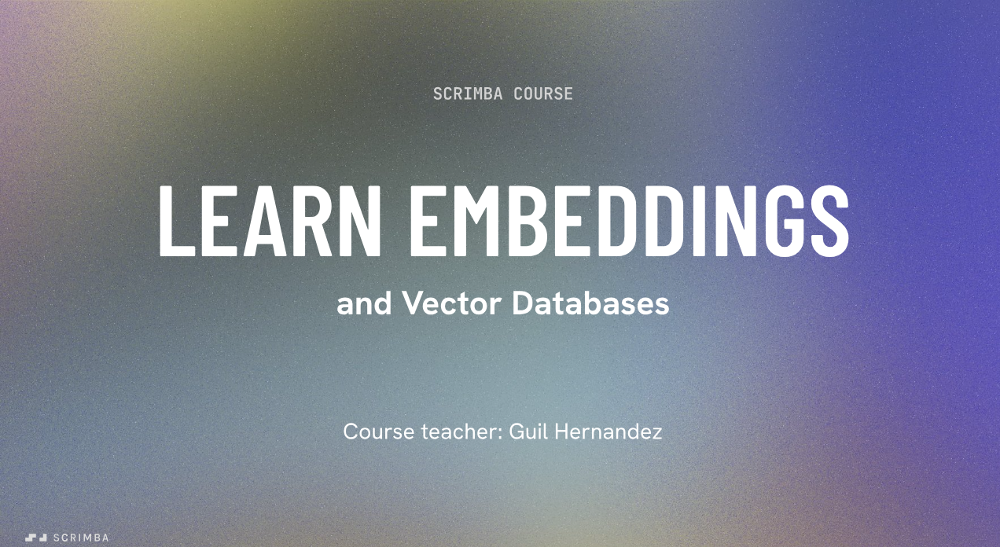

# RAG and Vector Databases

## Course Overview

Ever wondered how AI-powered chatbots respond so accurately, or how platforms like Spotify know exactly which song, show, or product to recommend based on your preferences? The answer lies in **vector embeddings** - the building blocks of many machine learning and AI algorithms.

This course demystifies embeddings and vector databases, teaching you how to build AI applications that can think and respond more like humans using custom data.

## Real-World Context: The Spotify Story

In 2014, Spotify faced a significant challenge: with tens of millions of tracks in its library, how could it help users quickly find songs they'd truly love? The solution was vector embeddings. By transforming songs, artists, and historical usage data into numerical vectors that capture the essence of the data (beyond simple genre labels), Spotify revolutionized its recommendation system. The result? A blazing-fast, highly personalized listening experience that made it the most popular service of its kind.

## What You'll Learn

### Core Concepts

- **Demystifying embeddings**: Understanding what they are and their importance in today's tech landscape
- **Vector representations**: Using OpenAI's embedding model to transform words and phrases into meaningful vectors
- **Vector databases**: Exploring their power and setting up your own database to store and manage embeddings

### Advanced Techniques

- **AI-driven search**: Learning the mechanisms behind how AI-powered chatbots and apps reply in natural, conversational ways
- **Text processing with LangChain**: Using this popular AI development framework to handle text splitting (chunking), a crucial step in preparing text for vector embedding
- **Practical application**: Creating an AI tool that replies based on custom data stored with vector embeddings

## Topics Covered

- Embedding basics
- Create embeddings with the OpenAI API
- Intro to vector databases
- Set up and use a vector database
- AI-driven search and conversations
- AI development framework LangChain
- Hands-on challenges and projects

## Prerequisites

Before starting this course, you should be familiar with:

- JavaScript fundamentals
- Asynchronous programming
- Working with the OpenAI API and its chat completions endpoints

If you need a refresher on these topics, check out the recommended prerequisite courses first.

## References

- [OpenAI Embeddings Documentation](https://platform.openai.com/docs/guides/embeddings)
- [LangChain Documentation](https://langchain.readthedocs.io/en/latest/)

## Course Details

**Instructor**: Guil Hernandez (Developer and Teacher at Scrimba)  
**Duration**: 90 minutes  
**Level**: Intermediate AI Engineering
