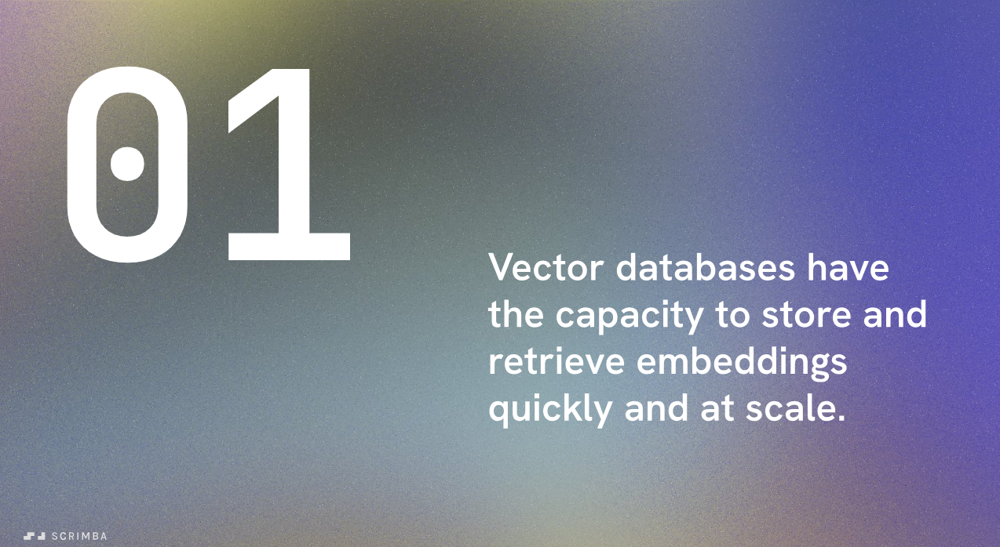
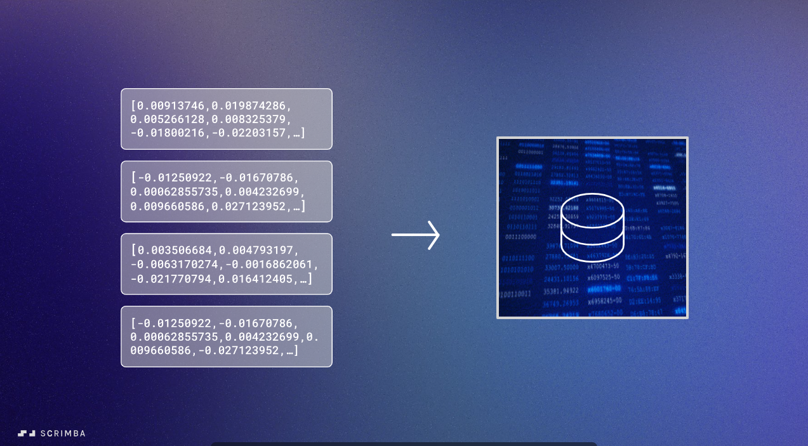
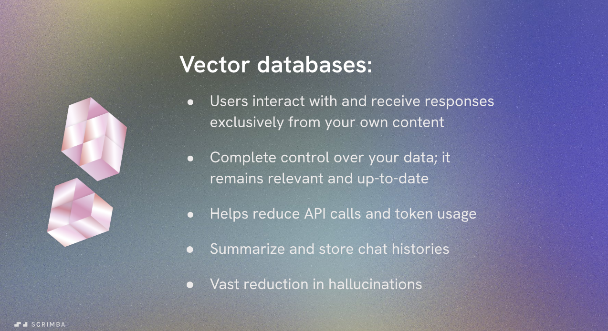

<!-- markdownlint-disable MD036 -->

# Vector Databases

## Overview

Vector databases (also called vector stores) are specialized databases designed to store and manage vector embeddings efficiently. They possess unique capabilities for handling embeddings with the capacity to store and retrieve them quickly and at scale.

## How Vector Databases Work

### Traditional Databases vs Vector Databases

Traditional databases operate by searching for exact value matches in rows - they look for specific data that matches a query precisely.

Vector databases, on the other hand, are fundamentally different. Instead of exact matching, they use **similarity metrics** to find the most relevant information.

### Similarity Metrics

Vector databases are powered by complex algorithms that:

- **Store** vector embeddings efficiently
- **Search** through vast amounts of vectorized data
- **Identify** similar vectors quickly using mathematical distance calculations

Rather than looking for exact matches, vector databases use similarity metrics that leverage all the semantic information encoded in the vectors. They analyze the meaning of words and phrases to find vectors most similar to a given query.

### Semantic Search in Action

For example, when you ask "Who's in charge of your company?", the vector database:

1. Converts your query into a vector embedding
2. Compares it against stored embeddings using similarity metrics
3. Returns the most semantically similar result - in this case, information about "Per Borgen - Scrimba CEO"

This demonstrates how embeddings allow us to match content to questions based on meaning, not just exact keyword matches.

## Benefits of Vector Databases

Storing custom information as embeddings in a vector database provides several powerful advantages:

### 1. **Exclusive Custom Content**

- Users interact with and receive responses exclusively from your own content
- No mixing with external or irrelevant data sources

### 2. **Complete Data Control**

- You have full control over your data
- Information remains relevant and up-to-date
- Easy to update and maintain your knowledge base

### 3. **Reduced API Costs**

- Helps reduce the number of API calls needed
- Lower token usage compared to sending all context with every request
- More cost-effective at scale

### 4. **Long-Term Memory**

- Enables summarization and storage of chat histories
- Allows AI systems to maintain a type of long-term memory
- Context persists across conversations

### 5. **Reduced Hallucinations**

- Acts as an important tool against AI hallucinations
- Grounds responses in actual stored data
- Provides verifiable source material for answers

## Popular Vector Database Options

Vector databases are becoming a central part of how we build AI-powered software and play a massive role in the advancements of large language models. Several excellent options are available:

- **Chroma** - Open-source, easy to use, great for development
- **Pinecone** - Managed service, highly scalable, production-ready
- **Supabase** - Full-featured platform with vector capabilities
- **And many others** - The ecosystem continues to grow

## Why Vector Databases Matter

Vector databases represent a fundamental shift in how we:

- Build AI-powered applications
- Enable semantic search capabilities
- Create context-aware AI systems
- Manage knowledge for large language models

They've become an essential component of modern AI architecture, particularly for applications using RAG (Retrieval-Augmented Generation) patterns where relevant context needs to be retrieved and provided to language models.

---

*This lesson is part of the AI Engineering module focusing on RAG and Vector Databases*
