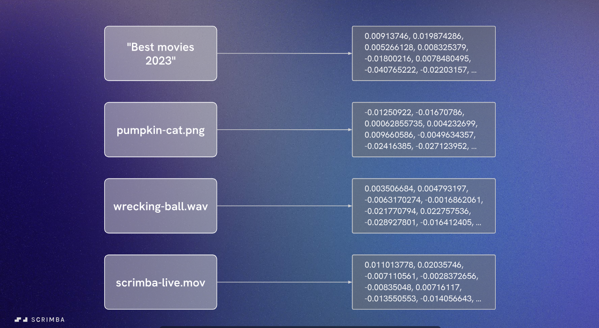

# What are embeddings?

## The AI Understanding Challenge

Advanced AIs, despite their capabilities, don't truly understand the real world as we do. They can't grasp the actual meaning or nuance of a video title, song, or news article. Yet platforms like Spotify, Netflix, and YouTube seem to "get us" - understanding, predicting, and responding to our preferences effectively.

**The solution?** A blend of algorithms, AI models, huge amounts of data, and most importantly: **embeddings**.

## Definition

> **Embeddings are the language that AI understands.**

When you present a question to an AI, it first needs to translate it into a format it can understand. The term "embedding" is a mathematical concept that refers to placing one object into a different space.

Think of it like taking a word or sentence (which exists in content space) and transforming it into a different representation - a set of numbers in vector space - all while preserving its original meaning and the relationships between other words and phrases.

## How Embeddings Work



AI systems process lots of data from user inputs to information in databases. At the heart of this processing are embeddings, which are **vectors representing that data**.

Transforming content like search queries, photos, songs, or videos into vectors gives machines the power to effectively compare, categorize, and understand the content in a way that's almost human.

## Understanding Vectors

Think of a vector as a **coordinate or point in space**. To keep things simple, let's look at a 2D graph with x and y axes:


### Example: Word Similarities in Vector Space

- **Cat** → vector `[4.5, 12.2]`
- **Feline** → vector `[4.7, 12.6]`
- **Kitten** → slightly further from cat/feline (age-related nuance)
- **Dog** → vector `[7.5, 10.5]` (different but same domain: domesticated animals)
- **"Man's best friend"** → close to dog vector
- **Building** → vector `[15.3, 3.9]` (completely unrelated, much further apart)

**Key insight:** Words that have similar meanings are numerically similar and tend to be closely positioned in vector space.

## Vector Arithmetic: Capturing Semantic Relationships

Embeddings can capture semantic meaning and relationships between words through vector arithmetic:

```text
king - man + woman = ?
```


Let's break this down:

- **King** → vector `[2, 5]`
- **Man** → vector `[1, 3]`
- **Woman** → vector `[1, 4]`

Calculation:

```text
[2, 5] - [1, 3] + [1, 4] = [2, 6]
```

The result `[2, 6]` is extremely close to the vector for **Queen** `[2.1, 6.2]`!

A trained AI model would identify "queen" as the most similar word based on that vector.

## Higher Dimensional Spaces

**Important:** A 2D graph is a massive simplification. Real-world embeddings often exist in much higher dimensional spaces, sometimes spanning **hundreds or even thousands of dimensions**.

### Example: The Word "Queen"

The actual vector embedding for "queen" might have values across multiple dimensions:

```text
[0.23, -0.45, 0.67, 0.12, -0.89, ... 0.34]  // 1536 dimensions for OpenAI embeddings
```

Each dimension or number in this vector might capture a different semantic or contextual aspect:

- Dimension 42: royalty
- Dimension 156: historical figures (Cleopatra)
- Dimension 789: chess
- And so on...

This allows AIs to recognize and differentiate between these contexts when the word is used in different scenarios.

### Clustering in Vector Space


Imagine embedding hundreds of thousands of words and phrases into this high-dimensional space:

- Some words naturally gravitate closer to one another due to their similarities, forming **clusters**
- Others are further apart or sparsely distributed in the space
- These relationships between vectors are extremely useful for AI understanding

## Real-World Applications

Embeddings shape many parts of our daily lives through AI-powered search:

### 1. **E-commerce (Amazon)**

- Product recommendations based on browsing and purchase history
- Understanding product relationships and similarities

### 2. **Search Engines**

- Evolved to understand the essence of queries and content
- Moving beyond mere keyword matching to semantic understanding

### 3. **Social Media Platforms**

- Curate tailored content feeds
- Understand user preferences and engagement patterns

### 4. **Streaming Services (YouTube, Netflix, Spotify)**

- Offer suggestions based on preferences
- Example: Spotify embeds tracks in vector space to find similar songs
- Netflix uses embeddings to create personalized platforms that maximize engagement and retention

### 5. **Healthcare**

- Analyze medical images
- Extract information doctors can use to diagnose diseases

### 6. **Finance**

- Analyze financial data
- Make predictions about stock prices or currency exchange rates

### 7. **AI Chatbots**

- Every interaction translates data into meaning
- Natural language understanding and response generation

## Key Takeaway

Behind the scenes, every time you interact with an AI chatbot or an app recommends something, **embeddings are at work translating data into meaning**. They are the fundamental building blocks that enable AI systems to process, understand, and respond to information in seemingly intelligent ways.
