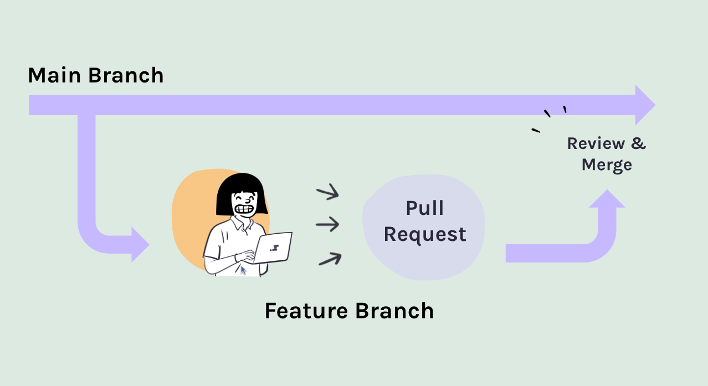

# Introduction to Branching and Pull Requests

In this section, we will cover the basics of branching and pull requests in Git & GitHub. These concepts are essential for collaborative software development and help teams work on features and fixes in isolation.

## What is a Branch?



A branch in Git is a separate line of development. It allows you to work on new features or bug fixes without affecting the main codebase. Once your work is complete, you can merge your changes back into the main branch, after being reviewed by your team.

### Creating a Branch

To create a new branch, use the following command:

```bash
git checkout -b new-feature
```

This command creates a new branch called `new-feature` and switches to it.

## What is a Pull Request?

A pull request (PR) is a way to propose changes to a codebase. When you create a pull request, you are asking the repository maintainers to review your changes and merge them into the main branch.

### Creating a Pull Request

To create a pull request, follow these steps:

1. Push your branch to the remote repository:

   ```bash
   git push origin new-feature
   ```

2. Go to the repository on GitHub.
3. Click on the "Pull Requests" tab.
4. Click the "New Pull Request" button.
5. Select your branch and the base branch (usually `main` or `master`).
6. Add a title and description for your pull request.
7. Click "Create Pull Request."

## Reviewing Pull Requests

Once a pull request is created, other team members can review the changes, leave comments, and request modifications. This process helps ensure code quality and facilitates collaboration.

## Merging Pull Requests

After the pull request is approved, it can be merged into the main branch. This can usually be done with a single click on the GitHub interface.

## Conclusion

Branching and pull requests are powerful features of Git that enable collaborative development. By using branches, you can work on new features without disrupting the main codebase. Pull requests provide a structured way to review and merge changes, ensuring code quality and team collaboration.
