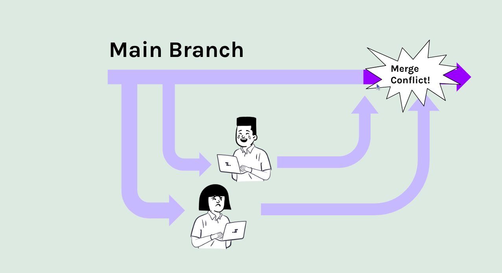

# Merge Conflicts in GitHub Desktop

## What is a Merge Conflict?

A merge conflict occurs when two branches or developers have changes on the same file that cannot be automatically merged by Git. This typically happens when:

- Two branches/developers modify the same line in a file.
- One branch deletes a file that the other branch modifies.

## How to Resolve Merge Conflicts

1. **Open GitHub Desktop**: Launch the GitHub Desktop application.

2. **Select Your Repository**: In the left sidebar, select the repository with the merge conflict.

3. **Go to the "Pull Requests" Tab**: Click on the "Pull Requests" tab in the top menu.

4. **Select the Pull Request**: Find the pull request with the merge conflict and click on it.

5. **View the Conflicts**: In the pull request details, you will see a message indicating that there are merge conflicts. Click on the "Resolve conflicts" button.

6. **Use the Conflict Editor**: GitHub Desktop will open a conflict editor where you can manually resolve the conflicts:
   - Conflicted sections will be marked with `<<<<<<<`, `=======`, and `>>>>>>>` markers.
   - Edit the file to resolve the conflicts by choosing which changes to keep.

7. **Mark as Resolved**: Once you have resolved all conflicts, click the "Mark as resolved" button.

8. **Commit the Changes**: After marking the conflicts as resolved, you will need to commit the changes. Provide a commit message and click the "Commit merge" button.

9. **Complete the Pull Request**: After resolving the conflicts and committing the changes, you can complete the pull request by clicking the "Merge Pull Request" button.

## Conclusion

Merge conflicts are a common occurrence in collaborative development. By following the steps outlined in this guide, you can effectively resolve merge conflicts in GitHub Desktop and keep your project moving forward.
