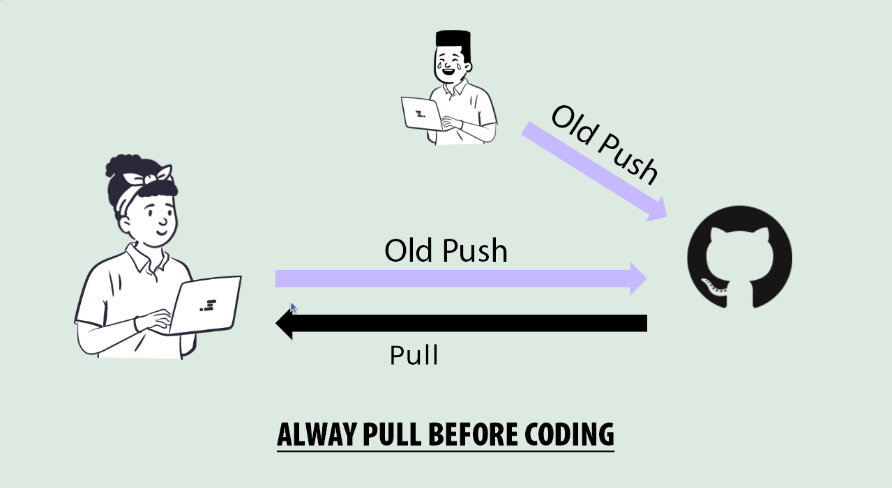

# Pulling Changes from a Remote Repository on GitHub Desktop

So far, we talked about pushing changes to a remote repository. Now, let's discuss how to pull changes from a remote repository using GitHub Desktop and the GitHub.com website.

When collaborating on a project using Git and GitHub, it's essential to keep your local repository up to date with the latest changes made by others. This is done using the `git pull` command, which fetches and integrates changes from a remote repository into your current branch.

## Steps to Pull Changes

1. **Open GitHub Desktop**: Launch the GitHub Desktop application on your computer.

2. **Select Your Repository**: In the left sidebar, select the repository you want to update.

3. **Fetch Changes**: Click on the "Fetch origin" button in the top bar. This will check for any changes in the remote repository.

4. **Pull Changes**: If there are changes available, the "Pull origin" button will become active. Click it to pull the latest changes into your local repository.

5. **Resolve Conflicts**: If there are any merge conflicts, GitHub Desktop will prompt you to resolve them. Follow the on-screen instructions to resolve conflicts and complete the pull.

6. **Review Changes**: After pulling, review the changes in your local repository to ensure everything is up to date.

By following these steps, you can easily pull changes from a remote repository using GitHub Desktop.

---

## Pulling Changes from GitHub.com Website

1. **Navigate to Your Repository**: Go to the GitHub.com website and navigate to the repository you want to update.

2. **Check for Changes**: Look for any changes in the repository that you want to pull into your local copy.

3. **Copy the Repository URL**: Click on the "Code" button and copy the repository URL.

4. **Open GitHub Desktop**: Launch the GitHub Desktop application on your computer.

5. **Select Your Repository**: In the left sidebar, select the repository you want to update.

6. **Fetch Changes**: Click on the "Fetch origin" button in the top bar. This will check for any changes in the remote repository.

7. **Pull Changes**: If there are changes available, the "Pull origin" button will become active. Click it to pull the latest changes into your local repository.

8. **Resolve Conflicts**: If there are any merge conflicts, GitHub Desktop will prompt you to resolve them. Follow the on-screen instructions to resolve conflicts and complete the pull.

9. **Review Changes**: After pulling, review the changes in your local repository to ensure everything is up to date.

By following these steps, you can easily pull changes from a remote repository using GitHub Desktop.

### Conclusion

Regularly pulling changes from the remote repository is crucial for collaboration. By regularly pulling changes, you ensure that you have the latest updates and can avoid potential conflicts down the line. Whether you use GitHub Desktop, GitHub Website, or the command line, the process is straightforward and essential for effective version control.

### Personal Note

>Before starting any new work, I **always make it a habit to pull the latest changes** from the remote repository. This practice helps me stay in sync with my team and minimizes the chances of encountering merge conflicts later on.
