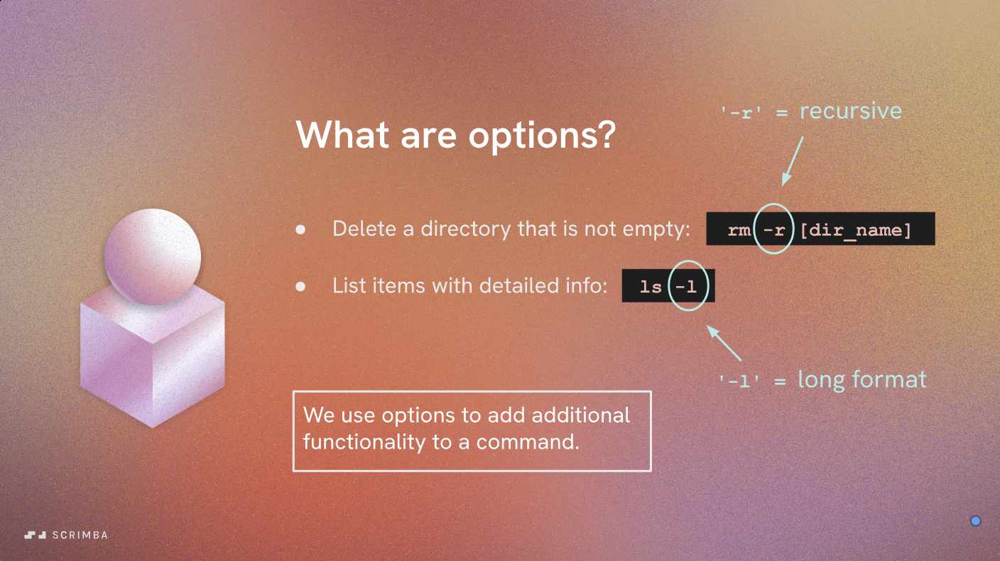

# Command Options

For each command, you can specify options that modify its behavior. Options are typically prefixed with one or two dashes (`-` or `--`) and can be placed before or after the command name. We use the single dash for short options (e.g., `-h` for help) and double dashes for more descriptive options (e.g., `--help`).

**Here are some common options you might encounter:**

## One dash options

- `-h` or `--help`: Displays help information about the command, including its usage and available options.
- `-v` or `--version`: Shows the current version of the CLI tool.
- `-f` or `--force`: Forces the command to execute, overriding any warnings or prompts.
- `-q` or `--quiet`: Suppresses output messages, making the command run silently.
- `-d` or `--debug`: Enables debug mode, providing more detailed output for troubleshooting.
- `-l` or `--log <file>`: Specifies a log file to which output should be written. With 'ls' command, it displays the output in a long listing format.
- `-r` or `--recursive`: Applies the command recursively to all subdirectories or items. Like what we used to remove a non-empty directory with `rm -r foldername`.
- `-p` or `--path <path>`: Specifies a custom path for the command to operate on.

## Two dash options

- `--config <file>`: Specifies a custom configuration file for the command to use.
- `--output <file>`: Directs the command's output to a specified file instead of the console.
- `--timeout <seconds>`: Sets a timeout duration for the command to complete its operation.
- `--verbose`: Provides more detailed output during the command's execution.

*N.B: The availability and functionality of these options may vary depending on the specific CLI tool you are using. Always refer to the tool's documentation or use the `--help` option to get detailed information about the commands and their options.*
