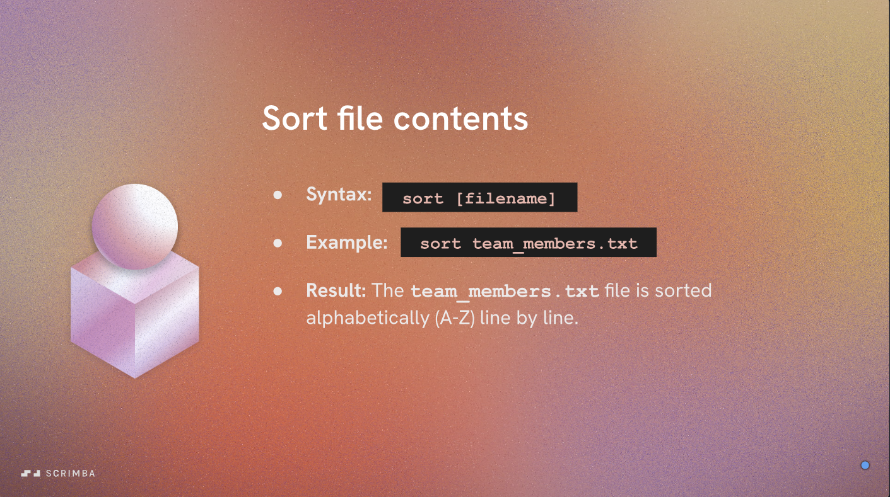
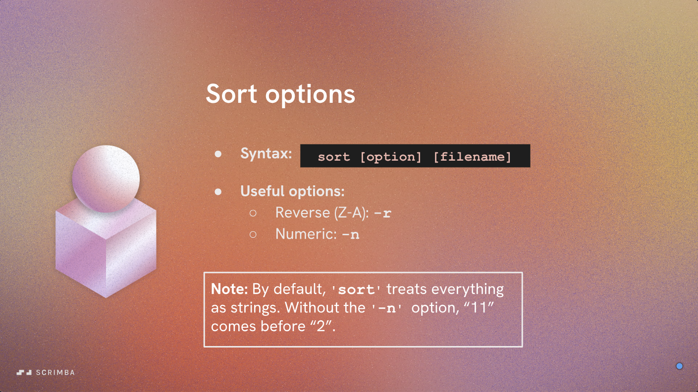
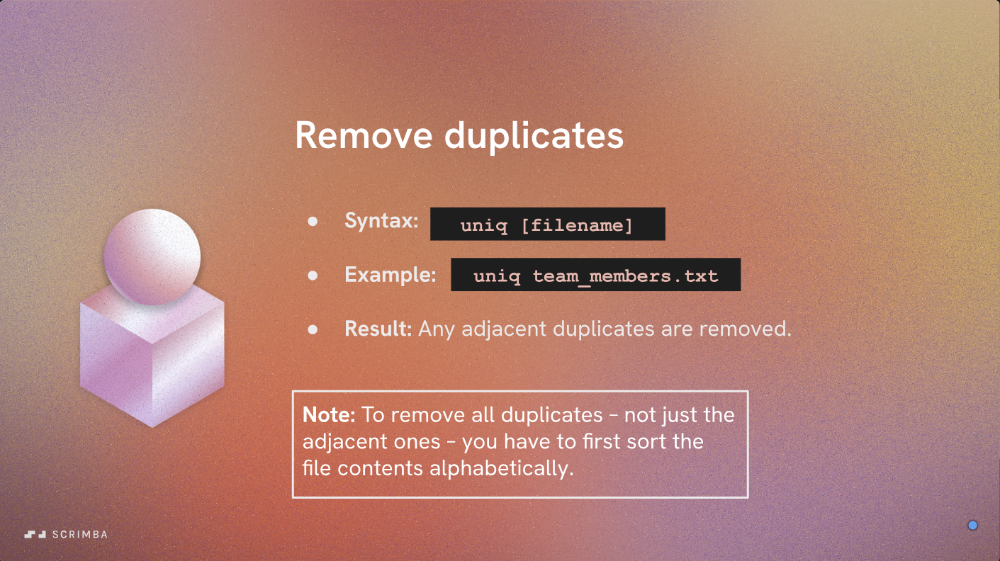

# Sorting File Contents - Part 1

In this section, we will learn how to sort the contents of files using command-line tools. Sorting is a common task when working with text data, and it can help you organize and analyze your information more effectively.

## Using `sort` to Sort Lines in a File

The `sort` command is a simple and powerful tool for sorting lines of text in a file. Here are some common usages:

- To sort the lines in a file alphabetically:

  ```bash
  sort filename.txt
  ```

- To sort the lines in reverse order:

  ```bash
  sort -r filename.txt
  ```

- To sort the lines numerically (useful for files with numbers):

  ```bash
  sort -n filename.txt
  ```

    Becareful of using `-n` with non-numeric data, as it may lead to unexpected results. By default, `sort` treats lines as strings and sorts them lexicographically. The `-n` option changes this behavior to sort based on numerical value, which is particularly useful when dealing with files that contain numbers.

- You can also combine these options to customize the sorting behavior:

  ```bash
  sort -n -r filename.txt
  ```

This will output the lines in the specified file sorted numerically in reverse order.

---

## Saving Sorted Output Back to the File

The `sort` command does not modify files in place. To save the sorted result back to the original file, use this two-step method:

```bash
sort filename.txt > filename.txt.sorted
mv filename.txt.sorted filename.txt
```

This will overwrite `filename.txt` with the sorted content. (Be careful: this method replaces the original file.)

|  |  |
|:-----------------------------------------------:|:-----------------------------------------------:|

---

## Using `uniq` to Remove Duplicate Lines

The `uniq` command is often used in conjunction with `sort` to remove duplicate lines from a file. Because if the lines are not exactly adjacent, `uniq` will not remove them. Here’s how:

- To remove duplicate lines from a sorted file:

  ```bash
  sort filename.txt | uniq
  ```

- To count the number of occurrences of each line:

  ```bash
  sort filename.txt | uniq -c
  ```



These commands can be very useful for cleaning up data and ensuring that you have a unique set of entries.
