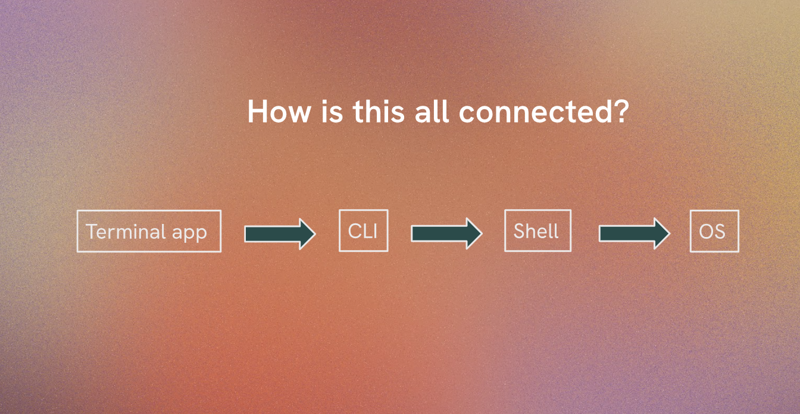

# Terminology

In this section, we will define key terms and concepts that are essential for understanding the tools and techniques covered in this curriculum.
Familiarity with these terms will help you navigate the material more effectively.

## What is the difference between Linux, shell, & command line interface (CLI)?

- **Linux:** is an open-source operating system that is widely used for servers, desktops, and embedded systems. It is highly customizable and supports a wide range of software applications.

- **Shell:** is a command-line interface that allows users to interact with the operating system by typing commands. It acts as an intermediary between the user commands and the operating system, interpreting and executing commands. An operating system is the software that manages computer hardware and software resources and provides common services for computer programs.

1. A program that lets you interact with the operating system by typing commands.
2. Interpret the commands you type in the CLI.
3. Several different types of shells, such as Bash, Zsh, and Fish.

- **CLI:** is the text-based interface where users can enter these commands to perform various tasks, such as file manipulation, program execution, and system monitoring.

1. The concept of interacting with a computer using text commands.
2. Displayed inside another app, e.g., Terminal (MacOS), Command Prompt (Windows), or GNOME Terminal (Linux).
3. Some apps and CLIs can run several different shells.

Terminal > CLI > Shell > OS

